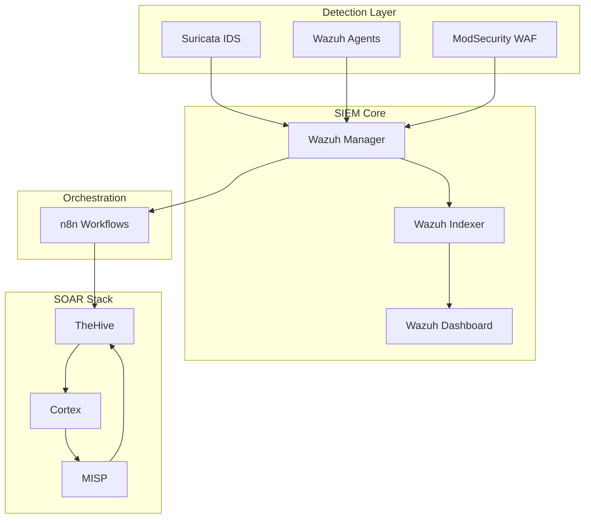
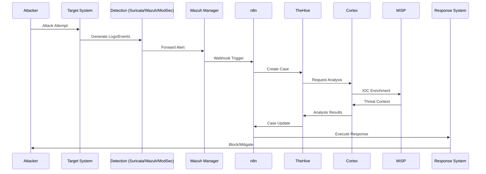

# 🏗️ Architecture du Système SOAR
## Vue d'Ensemble Technique et Diagrammes

> **Section 01 - ARCHITECTURE**  
> Documentation technique de l'architecture globale du système SIEM/SOAR

---

## 📋 Table des Matières

- [Vue d'Ensemble](#-vue-densemble)
- [Architecture Logique](#-architecture-logique)
- [Topologie Réseau](#-topologie-réseau)
- [Flux de Données](#-flux-de-données)
- [Composants Techniques](#-composants-techniques)
- [Sécurité et Isolation](#-sécurité-et-isolation)

---

## 🎯 Vue d'Ensemble

L'architecture SOAR est construite sur une approche **en couches** permettant une séparation claire des responsabilités et une évolutivité maximale.

### Principe Architectural

```
┌─────────────────────────────────────────────────────────────┐
│                    LAYER 4 - PRESENTATION                  │
│                     Dashboards & APIs                      │
├─────────────────────────────────────────────────────────────┤
│                   LAYER 3 - ORCHESTRATION                  │
│                    n8n Workflow Engine                     │
├─────────────────────────────────────────────────────────────┤
│                     LAYER 2 - ANALYSIS                     │
│              TheHive + Cortex + MISP Stack                 │  
├─────────────────────────────────────────────────────────────┤
│                    LAYER 1 - DETECTION                     │
│             Suricata + Wazuh + ModSecurity                 │
├─────────────────────────────────────────────────────────────┤
│                     LAYER 0 - DATA                         │
│                   Logs, Events, Alerts                     │
└─────────────────────────────────────────────────────────────┘
```

## 🏛️ Architecture Logique

### Composants Principaux

| Composant | Rôle | Port | Réseau |
|-----------|------|------|---------|
| **Wazuh Manager** | SIEM Central | 1514, 1515 | 192.168.15.3 |
| **Wazuh Dashboard** | Interface SIEM | 4443 | 192.168.15.3 |
| **TheHive** | Case Management | 9999 | 192.168.15.3 |
| **Cortex** | Analysis Engine | 9001 | 192.168.15.3 |
| **MISP** | Threat Intelligence | 4432 | 192.168.15.3 |
| **n8n** | Workflow Engine | 5678 | 192.168.15.3 |
| **Suricata** | IDS/IPS | - | Bridge Mode |
| **ModSecurity** | WAF | 80, 443 | 172.20.0.x |

### Architecture en Microservices



## 🌐 Topologie Réseau

### Segmentation Réseau

```
┌─────────────────────────────────────────────────────────────┐
│                    Internet                                 │
└─────────────────────┬───────────────────────────────────────┘
                      │
┌─────────────────────▼───────────────────────────────────────┐
│                pfSense Firewall                             │  
│                192.168.182.x                               │
└─────────────────────┬───────────────────────────────────────┘
                      │
        ┌─────────────┼─────────────┐
        │             │             │
┌───────▼─────┐ ┌─────▼──────┐ ┌───▼────────┐
│    LAN181   │ │   WAN182   │ │   LAN183   │
│192.168.181.x│ │External Net│ │192.168.183.x│
│   (Admin)   │ │            │ │  (Targets) │
└─────────────┘ └────────────┘ └────────────┘
        │
┌───────▼─────────────────────────────────────────────────────┐
│              SOAR Network Segment                           │
│                192.168.15.x                                │
├─────────────────────────────────────────────────────────────┤
│  Wazuh (15.3) │ TheHive (15.3) │ n8n (15.3) │ MISP (15.3) │
└─────────────────────────────────────────────────────────────┘
        │
┌───────▼─────────────────────────────────────────────────────┐
│              Docker Networks                                │  
│                172.20.0.x                                  │
├─────────────────────────────────────────────────────────────┤
│   ModSecurity │  DVWA  │  Suricata  │  Other Services     │
└─────────────────────────────────────────────────────────────┘
```

### Flux de Communications

| Source | Destination | Port | Protocole | Usage |
|--------|-------------|------|-----------|-------|
| Agents Wazuh | Wazuh Manager | 1514 | TCP/UDP | Log transmission |
| Agents Wazuh | Wazuh Manager | 1515 | TCP | Agent registration |
| n8n | TheHive | 9999 | HTTPS | Case creation |
| n8n | Cortex | 9001 | HTTPS | Analysis requests |
| TheHive | Cortex | 9001 | HTTPS | Analyzer execution |
| Cortex | MISP | 4432 | HTTPS | IOC enrichment |
| ModSecurity | n8n | 5678 | HTTP | Webhook alerts |

## 🔄 Flux de Données

### Cycle de Vie d'un Incident



### Data Pipeline Architecture

```
┌─────────────┐    ┌──────────────┐    ┌─────────────┐
│   Sources   │───▶│  Collection  │───▶│ Processing  │
│             │    │              │    │             │
│ • Network   │    │ • Wazuh      │    │ • Parsing   │
│ • Endpoints │    │ • Suricata   │    │ • Enrich    │  
│ • Web Apps  │    │ • ModSec     │    │ • Correlate │
└─────────────┘    └──────────────┘    └─────────────┘
                                              │
┌─────────────┐    ┌──────────────┐         │
│  Response   │◀───│  Analysis    │◀────────┘
│             │    │              │
│ • Blocking  │    │ • TheHive    │
│ • Alerts    │    │ • Cortex     │
│ • Reporting │    │ • MISP       │
└─────────────┘    └──────────────┘
```

## 🧩 Composants Techniques

### Stack de Détection

#### Suricata IDS/IPS
- **Mode**: IPS inline + IDS passive
- **Rules**: ET Open + Custom rules  
- **Output**: JSON logs vers Wazuh
- **Performance**: 1Gbps throughput

#### Wazuh SIEM
- **Architecture**: Manager + Indexer + Dashboard
- **Agents**: Windows, Linux endpoints
- **Rules**: OOTB + Custom decoders
- **Retention**: 90 jours hot, 1 an cold

#### ModSecurity WAF  
- **Engine**: libmodsecurity 3.0.8
- **Rules**: OWASP CRS + Custom
- **Mode**: Detection + Prevention
- **Integration**: Nginx reverse proxy

### Stack SOAR

#### TheHive (Case Management)
- **Database**: Cassandra cluster
- **Features**: Case tracking, observables, tasks
- **Integration**: REST API + webhooks
- **Users**: Multi-tenant, RBAC

#### Cortex (Analysis)  
- **Analyzers**: 100+ analyzers disponibles
- **Custom**: Développement d'analyzers spécifiques
- **Scaling**: Job queue avec Redis
- **Results**: Structured JSON reports

#### MISP (Threat Intelligence)
- **Feeds**: Public + Private feeds
- **Sharing**: Community sharing groups
- **Objects**: Custom objects définitions  
- **API**: PyMISP integration

## 🔒 Sécurité et Isolation

### Isolation des Services

```
┌─────────────────────────────────────────┐
│              DMZ Network                │
│            (192.168.15.x)               │  
├─────────────────────────────────────────┤
│  SOAR Services (TLS encrypted)          │
│  • TheHive, Cortex, MISP, n8n          │
└─────────────────┬───────────────────────┘
                  │ Firewall Rules
┌─────────────────▼───────────────────────┐
│            Management Network           │
│            (192.168.181.x)              │
├─────────────────────────────────────────┤  
│  Administrative Access Only             │
│  • SSH, Web interfaces                  │
└─────────────────────────────────────────┘
                  │
┌─────────────────▼───────────────────────┐
│            Production Network           │  
│            (192.168.183.x)              │
├─────────────────────────────────────────┤
│  Protected Systems                      │
│  • Monitored endpoints                  │
└─────────────────────────────────────────┘
```

### Chiffrement et Authentification

| Service | SSL/TLS | Auth Method | Certificates |
|---------|---------|-------------|--------------|
| TheHive | ✅ | Local + LDAP | Self-signed |
| Cortex | ✅ | API Keys | Self-signed |  
| MISP | ✅ | Local + API | Self-signed |
| Wazuh | ✅ | Internal PKI | Auto-generated |
| n8n | ✅ | Local auth | Self-signed |

## 📊 Performance et Dimensionnement

### Spécifications Minimales

| Composant | CPU | RAM | Stockage | Réseau |
|-----------|-----|-----|----------|--------|
| Wazuh Manager | 4 vCPU | 8GB | 100GB SSD | 1Gbps |
| TheHive | 2 vCPU | 4GB | 50GB SSD | 1Gbps |
| Cortex | 4 vCPU | 8GB | 100GB SSD | 1Gbps |
| MISP | 2 vCPU | 4GB | 50GB SSD | 1Gbps |
| Total | 12 vCPU | 24GB | 300GB | - |

### Métriques de Performance

- **Throughput**: 10,000 events/sec
- **Latency**: < 100ms processing time
- **Storage**: 1TB/mois log retention
- **Availability**: 99.9% uptime SLA

## 📈 Évolutivité

### Scaling Horizontal
- **Wazuh**: Multi-manager cluster
- **TheHive**: Cassandra scaling
- **Cortex**: Worker nodes scaling
- **MISP**: Database clustering

### Monitoring et Alerting
- **Health checks**: Docker healthchecks
- **Metrics**: Prometheus + Grafana
- **Alerting**: Email + Telegram notifications
- **Logs**: Centralized logging avec ELK

---

## 🔗 Références Techniques

- [Diagrammes détaillés](./diagrams/)
- [Topologie réseau](./network_topology/)  
- [Flux de données](./data_flows/)
- [Configuration réseau complète](../06_DEPLOYMENT/configuration/)

---
**Mise à jour** : Août 2025 - Med10S
