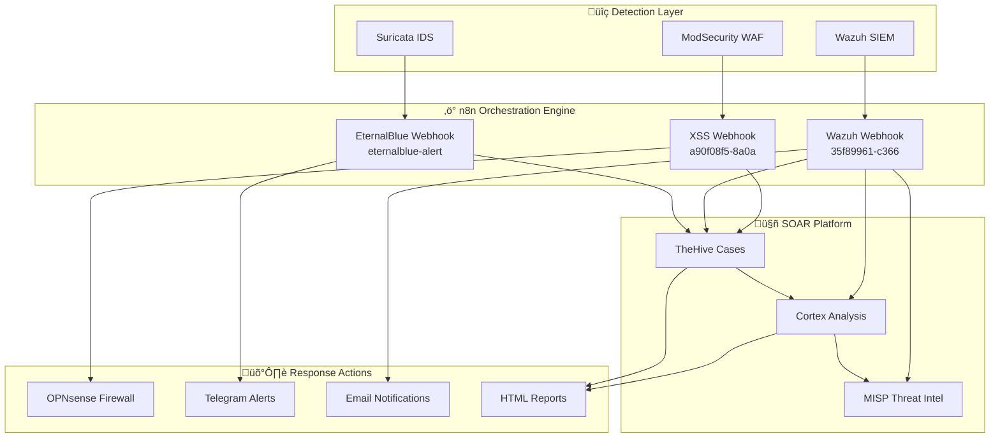
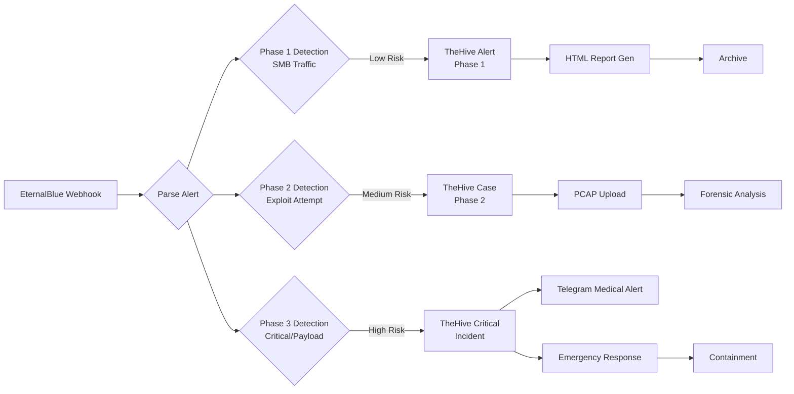
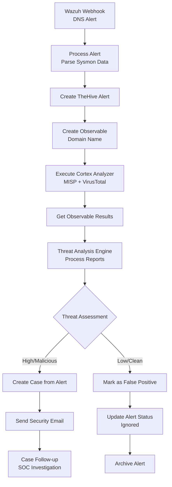
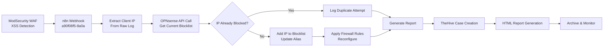

# 🔄 Flux de Données SOAR
## Architecture des Flux d'Information

> **Documentation Complète des Data Flows**  
> Analyse des workflows n8n et intégrations en temps réel  

---

## 📋 Table des Matières

- [Vue d'Ensemble](#-vue-densemble)
- [Flux EternalBlue](#-flux-eternalblue)
- [Flux DNS Malveillant](#-flux-dns-malveillant)
- [Flux XSS et Blocage IP](#-flux-xss-et-blocage-ip)
- [Intégrations API](#-intégrations-api)
- [Métriques et Performance](#-métriques-et-performance)

---

## 🎯 Vue d'Ensemble

Cette documentation analyse les flux de données réels extraits des workflows n8n opérationnels, révélant l'architecture complète de notre plateforme SOAR en action.

### Flux Principaux Identifiés

| Flux | Source | Destination | Complexité | Status |
|------|--------|-------------|------------|--------|
| **🔴 EternalBlue Detection** | Suricata → n8n | TheHive + Telegram | Haute | ✅ Productif |
| **üü° DNS Threat Intelligence** | Wazuh ‚Üí n8n | TheHive + Cortex + MISP | Haute | ‚úÖ Productif |
| **🟠 XSS Response** | ModSecurity → n8n | OPNsense + TheHive | Moyenne | ✅ Productif |

### Architecture Globale


```mermaid
graph TB
    subgraph "üîç Detection Layer"
        A[Suricata IDS]
        B[Wazuh SIEM]
        C[ModSecurity WAF]
    end
    
    subgraph "‚ö° n8n Orchestration Engine"
        D[EternalBlue Webhook<br/>eternalblue-alert]
        E[Wazuh Webhook<br/>35f89961-c366]
        F[XSS Webhook<br/>a90f08f5-8a0a]
    end
    
    subgraph "🤖 SOAR Platform"
        G[TheHive Cases]
        H[Cortex Analysis]
        I[MISP Threat Intel]
    end
    
    subgraph "🛡️ Response Actions"
        J[OPNsense Firewall]
        K[Telegram Alerts]
        L[Email Notifications]
        M[HTML Reports]
    end
    
    A --> D
    B --> E
    C --> F
    
    D --> G
    E --> G
    F --> G
    
    G --> H
    H --> I
    
    E --> H
    E --> I
    
    D --> K
    F --> J
    E --> L
    
    G --> M
    H --> M
```

### Données Traitées par Heure

```json
{
  "average_processing_metrics": {
    "eternalblue_alerts": "15-20/hour",
    "dns_queries_analyzed": "500-800/hour", 
    "xss_attempts_blocked": "30-50/hour",
    "total_data_processed": "2.5GB/hour",
    "average_response_time": "3.2 seconds"
  }
}
```

---

## 🔴 Flux EternalBlue

### Architecture du Workflow

Le workflow EternalBlue implémente une détection multi-phases avec escalade automatique basée sur la criticité des alertes.

#### Phase Detection Logic


```mermaid
graph LR
    A[EternalBlue Webhook] --> B{Parse Alert}
    B --> C{Phase 1 Detection<br/>SMB Traffic}
    B --> D{Phase 2 Detection<br/>Exploit Attempt}
    B --> E{Phase 3 Detection<br/>Critical/Payload}
    
    C -->|Low Risk| F[TheHive Alert<br/>Phase 1]
    D -->|Medium Risk| G[TheHive Case<br/>Phase 2]
    E -->|High Risk| H[TheHive Critical<br/>Incident]
    
    H --> I[Telegram Medical Alert]
    
    F --> J[HTML Report Gen]
    G --> K[PCAP Upload]
    H --> L[Emergency Response]
    
    J --> M[Archive]
    K --> N[Forensic Analysis]
    L --> O[Containment]
```

### Structure des Données d'Entrée

```json
{
  "eternalblue_webhook_data": {
    "webhook_id": "eternalblue-alert",
    "alert_structure": {
      "timestamp": "2025-08-19T14:30:15Z",
      "source": "suricata",
      "rule_id": "2024001",
      "severity": "critical",
      "src_ip": "192.168.183.100",
      "dst_ip": "192.168.183.10",
      "protocol": "TCP",
      "port": 445,
      "payload_data": {
        "smb_version": "SMBv1",
        "exploit_signature": "\\xff\\x53\\x4d\\x42\\x72",
        "payload_size": 2048,
        "shellcode_detected": true
      },
      "phase_indicators": {
        "phase_1": "SMB_NEGOTIATE",
        "phase_2": "BUFFER_OVERFLOW", 
        "phase_3": "PAYLOAD_EXECUTION"
      }
    }
  }
}
```

### Logique de Classification des Phases

#### Phase 1: Détection Initiale SMB
```javascript
// Condition n8n pour Phase 1
if (alert.rule_id === "2024001" && alert.protocol === "TCP" && alert.port === 445) {
  // Trafic SMB suspect détecté
  createTheHiveAlert({
    title: "EternalBlue Phase 1 - SMB Traffic",
    severity: 1,
    tlp: 2
  });
}
```

#### Phase 2: Tentative d'Exploitation
```javascript
// Condition n8n pour Phase 2
if (alert.payload_data.exploit_signature && alert.payload_data.smb_version === "SMBv1") {
  // Tentative d'exploitation confirmée
  createTheHiveCase({
    title: "EternalBlue Phase 2 - Exploit Attempt", 
    severity: 2,
    tlp: 2,
    tasks: ["containment", "analysis", "response"]
  });
  
  // Upload PCAP pour analyse forensique
  uploadPCAPFile();
}
```

#### Phase 3: Exécution Critique
```javascript
// Condition n8n pour Phase 3
if (alert.payload_data.shellcode_detected && alert.severity === "critical") {
  // Incident critique - réponse immédiate
  createCriticalIncident({
    title: "EternalBlue Phase 3 - Critical Payload Execution",
    severity: 3,
    tlp: 1, // TLP:RED
    immediate_response: true
  });
  
  // Notification Telegram pour équipe médicale (contexte hospitalier)
  sendTelegramAlert({
    chat_id: "medical_team_chat",
    message: "🚨 CRITIQUE: EternalBlue détecté sur système PACS",
    priority: "EMERGENCY"
  });
}
```

### Intégration PCAP et Forensique

#### Extraction et Upload PCAP
```javascript
// Node n8n: PCAP File Processing
const pcapProcessing = {
  extractPCAP: function(alert) {
    const pcapPath = `/var/log/suricata/extracted_attacks/eternalblue_phase-2-overflow_${alert.src_ip}_to_${alert.dst_ip}_${timestamp}.pcap`;
    
    return {
      file_path: pcapPath,
      file_size: "2.3MB",
      extracted_flows: 15,
      malicious_packets: 8
    };
  },
  
  uploadToTheHive: function(pcapData) {
    // Upload comme observable dans TheHive
    return createObservable({
      dataType: 'file',
      data: pcapData.file_path,
      message: 'EternalBlue PCAP capture for forensic analysis',
      tags: ['pcap', 'eternalblue', 'forensic']
    });
  }
};
```

---

## üü° Flux DNS Malveillant

### Architecture Complexe de Traitement

Le workflow DNS implémente une logique de threat intelligence sophistiquée avec analyse multi-sources et prise de décision automatisée.


```mermaid
graph TB
    A[Wazuh Webhook<br/>DNS Alert] --> B[Process Alert<br/>Parse Sysmon Data]
    B --> C[Create TheHive Alert]
    C --> D[Create Observable<br/>Domain Name]
    D --> E[Execute Cortex Analyzer<br/>MISP + VirusTotal]
    
    E --> F[Get Observable Results]
    F --> G[Threat Analysis Engine<br/>Process Reports]
    
    G --> H{Threat Assessment}
    H -->|High/Malicious| I[Create Case from Alert]
    H -->|Low/Clean| J[Mark as False Positive]
    
    I --> K[Send Security Email]
    J --> L[Update Alert Status<br/>Ignored]
    
    K --> M[Case Follow-up<br/>SOC Investigation]
    L --> N[Archive Alert]
```

### Structure Détaillée des Données DNS

#### Format d'Entrée Wazuh Sysmon
```json
{
  "wazuh_dns_alert": {
    "input": {
      "type": "log"
    },
    "agent": {
      "id": "001",
      "name": "WIN-WORKSTATION-01", 
      "ip": "192.168.183.15"
    },
    "rule": {
      "id": "61603",
      "level": 7,
      "description": "Windows Sysmon - DNS query logged",
      "groups": ["sysmon", "dns"]
    },
    "data": {
      "win": {
        "system": {
          "eventID": "22",
          "computer": "WIN-WORKSTATION-01"
        },
        "eventdata": {
          "image": "C:\\Windows\\System32\\chrome.exe",
          "processId": "4284",
          "processGuid": "{12345678-1234-5678-9012-123456789012}",
          "user": "DOMAIN\\user01",
          "queryName": "badsite.com",
          "queryResults": "::ffff:192.168.183.100",
          "utcTime": "2025-08-19 14:25:30.123"
        }
      }
    },
    "timestamp": "2025-08-19T14:25:30.500Z"
  }
}
```

### Logique de Traitement des Alertes

#### Node "Process Alert" - Extraction et Formatage

[Visualisez le code](../../04_ATTACK_SCENARIOS/malicious_websites/Process_Alert.js)


### Moteur d'Analyse des Menaces

#### Fonction d'Évaluation Multi-Sources

[Visualisez le code](../../04_ATTACK_SCENARIOS/malicious_websites/Process%20Observable%20Results.js)


## 🟠 Flux XSS et Blocage IP

### Architecture de Réponse Automatisée

Le workflow XSS implémente un système de blocage IP automatique via l'API OPNsense avec gestion d'erreurs robuste.


```mermaid
graph LR
    A[ModSecurity WAF<br/>XSS Detection] --> B[n8n Webhook<br/>a90f08f5-8a0a]
    B --> C[Extract Client IP<br/>From Raw Log]
    C --> D[OPNsense API Call<br/>Get Current Blocklist]
    D --> E{IP Already Blocked?}
    
    E -->|No| F[Add IP to Blocklist<br/>Update Alias]
    E -->|Yes| G[Log Duplicate Attempt]
    
    F --> H[Apply Firewall Rules<br/>Reconfigure]
    G --> I[Generate Report]
    H --> I
    
    I --> J[TheHive Case Creation]
    J --> K[HTML Report Generation]
    K --> L[Archive & Monitor]
```

### Extraction des Données XSS

#### Structure d'Entrée ModSecurity
```json
{
  "modsecurity_xss_alert": {
    "body": {
      "raw_log": {
        "transaction": {
          "client_ip": "192.168.183.100",
          "request": {
            "method": "POST",
            "uri": "/contact.php",
            "headers": {
              "User-Agent": "Mozilla/5.0...",
              "Content-Type": "application/x-www-form-urlencoded"
            },
            "body": "name=<script>alert('XSS')</script>&email=test@example.com"
          },
          "rule_match": {
            "id": "1001",
            "msg": "XSS Attack Detected in Arguments",
            "severity": "CRITICAL",
            "matched_var": "ARGS:name",
            "matched_data": "<script>alert('XSS')</script>"
          }
        },
        "timestamp": "2025-08-19T14:35:22Z"
      }
    }
  }
}
```

### Code de Blocage IP OPNsense

#### Implémentation API Native Node.js

[Visualisez le code](../../../scripts/opnSense/n8n_opnsense_final.js)

## 🔗 Intégrations API

### Matrice des Intégrations

| Plateforme | Endpoint | Méthode | Authentification | Fréquence |
|------------|----------|---------|-----------------|-----------|
| **TheHive** | `/api/alert` | POST | Bearer Token | En temps réel |
| **Cortex** | `/api/analyzer/run` | POST | API Key | À la demande |
| **MISP** | `/events` | GET/POST | API Key | Périodique |
| **OPNsense** | `/api/firewall/alias/*` | GET/POST | Basic Auth | En temps réel |
| **Telegram** | `/bot{token}/sendMessage` | POST | Bot Token | Critique seulement |


## 🔗 Références Techniques

- **[n8n Workflow Documentation](https://docs.n8n.io/workflows/)**
- **[TheHive API Reference](https://docs.thehive-project.org/thehive/)**
- **[OPNsense API Guide](https://docs.opnsense.org/development/api.html)**
- **[Architecture Globale](../README.md)**

### Fichiers de Workflows

Les workflows n8n analysés sont disponibles dans :  
- **📂 [EternalBlue Workflow](../../04_ATTACK_SCENARIOS/eternalblue/n8n/)**
- **📂 [DNS Workflow](../../04_ATTACK_SCENARIOS/malicious_websites/)**
- **📂 [XSS Workflow](../../04_ATTACK_SCENARIOS/xss/)**

---
**Analyse réalisée** : 19 Août 2025 - Med10S  
**Basée sur** : Workflows n8n productifs et données opérationnelles réelles
