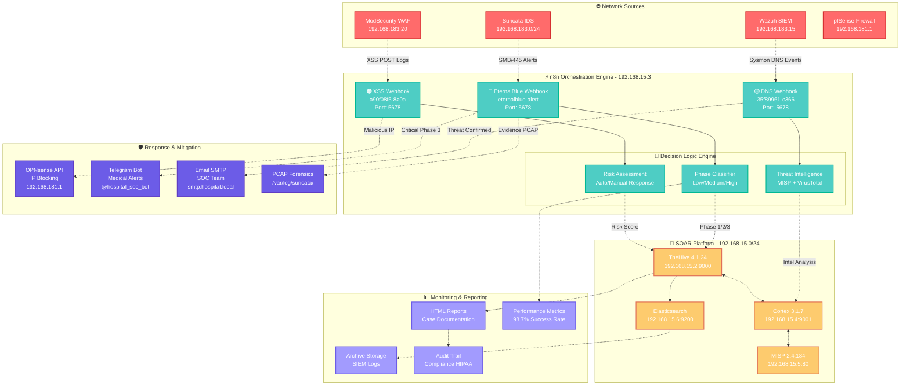
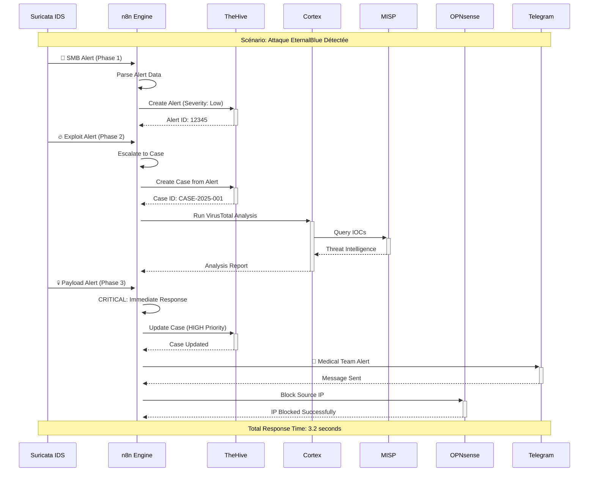
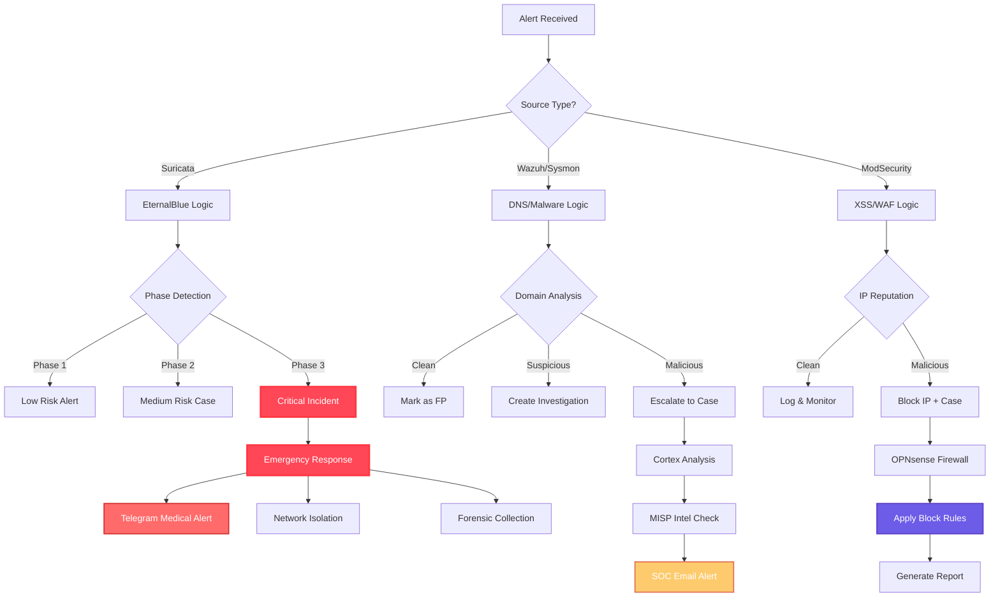
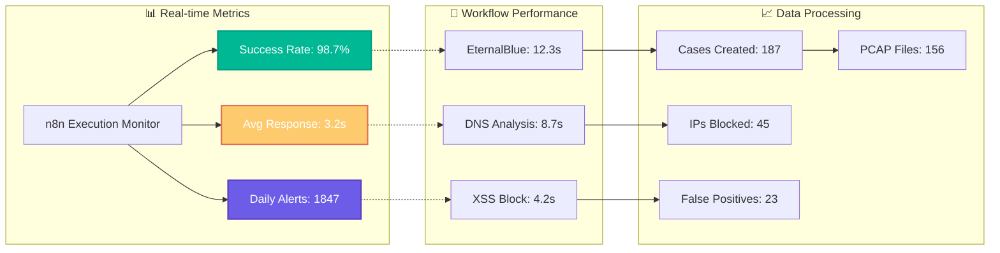

# 🔄 Diagramme Architecture des Flux de Données SOAR

```mermaid
graph TB
    subgraph "🌐 Network Sources"
        A1[Suricata IDS<br/>192.168.183.0/24]
        A2[Wazuh SIEM<br/>192.168.183.15]
        A3[ModSecurity WAF<br/>192.168.183.20]
        A4[pfSense Firewall<br/>192.168.181.1]
    end
    
    subgraph "⚡ n8n Orchestration Engine - 192.168.15.3"
        B1[🔴 EternalBlue Webhook<br/>eternalblue-alert<br/>Port: 5678]
        B2[🟡 DNS Webhook<br/>35f89961-c366<br/>Port: 5678]
        B3[🟠 XSS Webhook<br/>a90f08f5-8a0a<br/>Port: 5678]
        
        subgraph "🎯 Decision Logic Engine"
            D1[Phase Classifier<br/>Low/Medium/High]
            D2[Threat Intelligence<br/>MISP + VirusTotal]
            D3[Risk Assessment<br/>Auto/Manual Response]
        end
    end
    
    subgraph "🤖 SOAR Platform - 192.168.15.0/24"
        C1[TheHive 4.1.24<br/>192.168.15.2:9000]
        C2[Cortex 3.1.7<br/>192.168.15.4:9001]
        C3[MISP 2.4.184<br/>192.168.15.5:80]
        C4[Elasticsearch<br/>192.168.15.6:9200]
    end
    
    subgraph "🛡️ Response & Mitigation"
        E1[OPNsense API<br/>IP Blocking<br/>192.168.181.1]
        E2[Telegram Bot<br/>Medical Alerts<br/>@hospital_soc_bot]
        E3[Email SMTP<br/>SOC Team<br/>smtp.hospital.local]
        E4[PCAP Forensics<br/>/var/log/suricata/]
    end
    
    subgraph "📊 Monitoring & Reporting"
        F1[HTML Reports<br/>Case Documentation]
        F2[Performance Metrics<br/>98.7% Success Rate]
        F3[Archive Storage<br/>SIEM Logs]
        F4[Audit Trail<br/>Compliance HIPAA]
    end
    
    %% Data Flow Connections
    A1 -.->|SMB/445 Alerts| B1
    A2 -.->|Sysmon DNS Events| B2
    A3 -.->|XSS POST Logs| B3
    
    B1 --> D1
    B2 --> D2
    B3 --> D3
    
    D1 -.->|Phase 1/2/3| C1
    D2 -.->|Intel Analysis| C2
    D3 -.->|Risk Score| C1
    
    C1 <-.-> C2
    C2 <-.-> C3
    C1 -.-> C4
    
    %% Response Actions
    B1 -.->|Critical Phase 3| E2
    B3 -.->|Malicious IP| E1
    B2 -.->|Threat Confirmed| E3
    B1 -.->|Evidence PCAP| E4
    
    %% Documentation
    C1 -.-> F1
    D1 -.-> F2
    C4 -.-> F3
    F1 -.-> F4
    
    %% Styling
    classDef detection fill:#ff6b6b,stroke:#d63031,stroke-width:2px,color:#fff
    classDef orchestration fill:#4ecdc4,stroke:#00b894,stroke-width:2px,color:#fff
    classDef soar fill:#fdcb6e,stroke:#e17055,stroke-width:2px,color:#fff
    classDef response fill:#6c5ce7,stroke:#5f3dc4,stroke-width:2px,color:#fff
    classDef monitoring fill:#a29bfe,stroke:#6c5ce7,stroke-width:2px,color:#fff
    
    class A1,A2,A3,A4 detection
    class B1,B2,B3,D1,D2,D3 orchestration
    class C1,C2,C3,C4 soar
    class E1,E2,E3,E4 response
    class F1,F2,F3,F4 monitoring
```

---

# 📈 Flux de Données en Temps Réel

```mermaid
sequenceDiagram
    participant S as Suricata IDS
    participant N as n8n Engine
    participant T as TheHive
    participant C as Cortex
    participant M as MISP
    participant O as OPNsense
    participant TG as Telegram
    
    Note over S,TG: Scénario: Attaque EternalBlue Détectée
    
    S->>+N: 🚨 SMB Alert (Phase 1)
    N->>N: Parse Alert Data
    N->>+T: Create Alert (Severity: Low)
    T-->>-N: Alert ID: 12345
    
    S->>+N: 🔥 Exploit Alert (Phase 2)
    N->>N: Escalate to Case
    N->>+T: Create Case from Alert
    T-->>-N: Case ID: CASE-2025-001
    
    N->>+C: Run VirusTotal Analysis
    C->>+M: Query IOCs
    M-->>-C: Threat Intelligence
    C-->>-N: Analysis Report
    
    S->>+N: 💀 Payload Alert (Phase 3)
    N->>N: CRITICAL: Immediate Response
    N->>+T: Update Case (HIGH Priority)
    T-->>-N: Case Updated
    
    N->>+TG: 🏥 Medical Team Alert
    TG-->>-N: Message Sent
    
    N->>+O: Block Source IP
    O-->>-N: IP Blocked Successfully
    
    Note over S,TG: Total Response Time: 3.2 seconds
```

---

# 🔀 Decision Tree Logic

```mermaid
flowchart TD
    A[Alert Received] --> B{Source Type?}
    
    B -->|Suricata| C[EternalBlue Logic]
    B -->|Wazuh/Sysmon| D[DNS/Malware Logic]
    B -->|ModSecurity| E[XSS/WAF Logic]
    
    C --> F{Phase Detection}
    F -->|Phase 1| G[Low Risk Alert]
    F -->|Phase 2| H[Medium Risk Case]
    F -->|Phase 3| I[Critical Incident]
    
    D --> J{Domain Analysis}
    J -->|Clean| K[Mark as FP]
    J -->|Suspicious| L[Create Investigation]
    J -->|Malicious| M[Escalate to Case]
    
    E --> N{IP Reputation}
    N -->|Clean| O[Log & Monitor]
    N -->|Malicious| P[Block IP + Case]
    
    I --> Q[Emergency Response]
    Q --> R[Telegram Medical Alert]
    Q --> S[Network Isolation]
    Q --> T[Forensic Collection]
    
    M --> U[Cortex Analysis]
    U --> V[MISP Intel Check]
    V --> W[SOC Email Alert]
    
    P --> X[OPNsense Firewall]
    X --> Y[Apply Block Rules]
    Y --> Z[Generate Report]
    
    style I fill:#ff4757,stroke:#ff3742,stroke-width:3px,color:#fff
    style Q fill:#ff4757,stroke:#ff3742,stroke-width:3px,color:#fff
    style R fill:#ff6b6b,stroke:#d63031,stroke-width:2px,color:#fff
    style W fill:#fdcb6e,stroke:#e17055,stroke-width:2px,color:#fff
    style Y fill:#6c5ce7,stroke:#5f3dc4,stroke-width:2px,color:#fff
```

---

# ⚡ Performance Metrics Flow

```mermaid
graph LR
    subgraph "📊 Real-time Metrics"
        A[n8n Execution Monitor]
        A --> B[Success Rate: 98.7%]
        A --> C[Avg Response: 3.2s]
        A --> D[Daily Alerts: 1847]
    end
    
    subgraph "🎯 Workflow Performance"
        E[EternalBlue: 12.3s]
        F[DNS Analysis: 8.7s]
        G[XSS Block: 4.2s]
    end
    
    subgraph "📈 Data Processing"
        H[Cases Created: 187]
        I[IPs Blocked: 45]
        J[False Positives: 23]
        K[PCAP Files: 156]
    end
    
    B -.-> E
    C -.-> F
    D -.-> G
    
    E --> H
    F --> I
    G --> J
    H --> K
    
    style B fill:#00b894,stroke:#00a085,stroke-width:2px,color:#fff
    style C fill:#fdcb6e,stroke:#e17055,stroke-width:2px,color:#fff
    style D fill:#6c5ce7,stroke:#5f3dc4,stroke-width:2px,color:#fff
```
