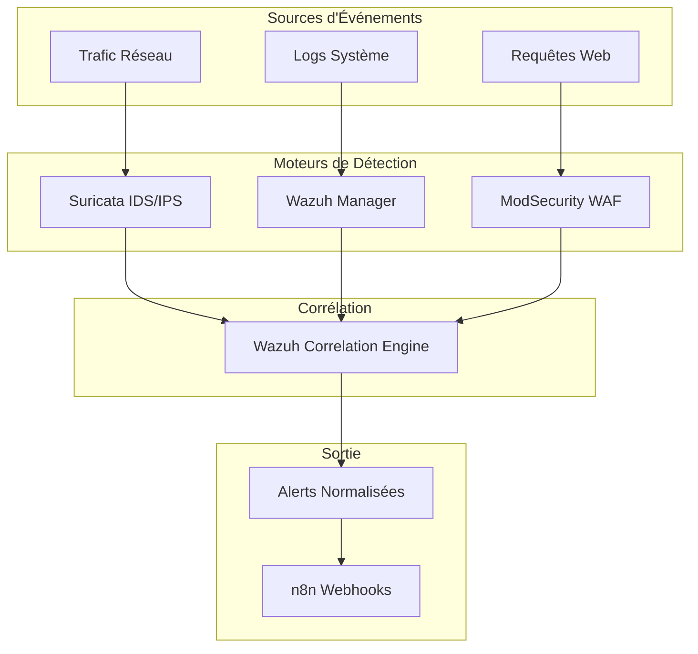

# 🔍 Couche de Détection
## Systèmes de Détection et de Monitoring

> **Section 02 - DETECTION LAYER**  
> Configuration et intégration des outils de détection

---

## 📋 Table des Matières

- [Vue d'Ensemble](#-vue-densemble)
- [Architecture de Détection](#-architecture-de-détection)
- [Composants](#-composants)
- [Corrélation d'Événements](#-corrélation-dévénements)
- [Performance et Tuning](#-performance-et-tuning)

---

## 🎯 Vue d'Ensemble

La couche de détection constitue le **premier niveau** de notre architecture SOAR. Elle combine trois technologies complémentaires pour une couverture de sécurité maximale.

### Philosophie de Détection

```
┌─────────────────────────────────────────────────────────────┐
│                    DETECTION COVERAGE                       │
├─────────────────┬─────────────────┬─────────────────────────┤
│    Network      │    Endpoint     │      Web Apps           │
│   (Suricata)    │    (Wazuh)      │   (ModSecurity)         │
│                 │                 │                         │
│ • IDS/IPS       │ • HIDS          │ • WAF                   │
│ • DPI           │ • Log Analysis  │ • OWASP Protection      │
│ • Signatures    │ • Integrity     │ • Custom Rules          │
│ • Anomalies     │ • Rootkit Det   │ • Attack Prevention     │
└─────────────────┴─────────────────┴─────────────────────────┘
```

## 🏗️ Architecture de Détection

### Flux de Détection Intégré



## 🧩 Composants

### [🔍 Suricata - IDS/IPS Réseau](./suricata/)

**Rôle** : Détection d'intrusion réseau en temps réel  
**Mode** : IPS inline + IDS passif  
**Couverture** : Couche 2-7 du modèle OSI

#### Capabilities Principales
- **Signature Detection** : 30,000+ règles ET Open
- **Protocol Detection** : HTTP, DNS, TLS, SMB, etc.
- **Anomaly Detection** : Comportements suspects
- **File Extraction** : Malware, PCAP capture

#### Configuration Clé
```yaml
# Mode d'opération
runmode: workers
# Interface monitoring  
af-packet:
  - interface: eth0
    cluster-id: 99
    cluster-type: cluster_flow
# Règles actives
default-rule-path: /var/lib/suricata/rules
rule-files:
  - suricata.rules
  - emerging-threats.rules
```

#### Intégration SOAR
- **Output** : JSON logs vers Wazuh  
- **Alerting** : Webhook vers n8n
- **PCAP** : Extraction automatique pour analyse

---

### [📊 Wazuh - SIEM Central](./wazuh/)

**Rôle** : Système central de gestion des logs et corrélation  
**Architecture** : Manager + Indexer + Dashboard  
**Agents** : Windows, Linux, macOS

#### Capabilities Principales
- **Log Collection** : 500+ types de logs
- **Rule Engine** : 3,000+ règles OOTB  
- **Correlation** : Multi-event correlation
- **Compliance** : PCI-DSS, HIPAA, NIST

#### Agents Déployés
| Agent | Système | Rôle |
|-------|---------|------|
| Windows Agent | Endpoints | Sysmon, EventLog |
| Linux Agent | Servers | Syslog, Auth logs |
| ModSecurity Agent | WAF Container | Web attacks |

#### Configuration Manager
```xml
<ossec_config>
  <global>
    <jsonout_output>yes</jsonout_output>
    <logall>no</logall>
    <logall_json>no</logall_json>
  </global>
  
  <alerts>
    <log_alert_level>3</log_alert_level>
  </alerts>
  
  <integration>
    <name>webhook</name>
    <url>http://n8n:5678/webhook/wazuh</url>
    <alert_format>json</alert_format>
  </integration>
</ossec_config>
```

#### Custom Decoders
- **ModSecurity Decoder** : Parse WAF logs
- **Suricata Decoder** : IDS alert enrichment
- **Custom Apps** : Business logic events

---

### [🛡️ ModSecurity - Web Application Firewall](./modsecurity/)

**Rôle** : Protection des applications web  
**Mode** : Detection + Prevention  
**Engine** : libmodsecurity 3.0.8

#### Capabilities Principales
- **OWASP CRS** : Core Rule Set v3.3
- **Custom Rules** : Application-specific
- **Real-time Blocking** : Immediate response
- **Detailed Logging** : Full transaction logs

#### Protection Coverage
```
┌─────────────────────────────────────┐
│            OWASP Top 10             │
├─────────────────────────────────────┤
│ ✅ A01 - Injection                  │
│ ✅ A02 - Broken Authentication      │  
│ ✅ A03 - Sensitive Data Exposure    │
│ ✅ A04 - XXE                        │
│ ✅ A05 - Broken Access Control      │
│ ✅ A06 - Security Misconfig         │
│ ✅ A07 - Cross-Site Scripting       │
│ ✅ A08 - Insecure Deserialization   │
│ ✅ A09 - Known Vulnerabilities      │
│ ✅ A10 - Insufficient Logging       │
└─────────────────────────────────────┘
```

#### Configuration Principale
```apache
SecRuleEngine On
SecRequestBodyAccess On
SecResponseBodyAccess On

# OWASP CRS
Include /etc/modsecurity.d/owasp-crs/crs-setup.conf
Include /etc/modsecurity.d/owasp-crs/rules/*.conf

# Custom Rules
Include /etc/modsecurity.d/custom-rules/*.conf
Include /etc/modsecurity.d/blocked_ips.conf
```

## 🔗 Corrélation d'Événements

### Règles de Corrélation Wazuh

#### Détection d'Attaques Multi-Vecteurs
```xml
<rule id="100001" level="12">
  <if_matched_sid>31100,31101,31102</if_matched_sid>
  <same_source_ip />
  <description>Multiple attack vectors detected from same IP</description>
  <group>correlation,attack,</group>
</rule>
```

#### EternalBlue Attack Chain
```xml
<rule id="100002" level="15">
  <if_matched_group>suricata</if_matched_group>
  <field name="alert.signature">ET EXPLOIT.*SMB</field>
  <description>EternalBlue exploit attempt detected</description>
  <group>exploit,eternalblue,</group>
</rule>
```

#### XSS Attack Detection
```xml
<rule id="100003" level="10">
  <if_matched_group>modsecurity</if_matched_group>
  <field name="transaction.messages.message">XSS Attack</field>
  <description>Cross-Site Scripting attack blocked</description>
  <group>web,xss,blocked,</group>
</rule>
```

### Enrichissement d'Alertes

#### GeoIP Integration
```xml
<decoder name="geoip-location">
  <parent>json</parent>
  <plugin_decoder>geoip</plugin_decoder>
</decoder>
```

#### Threat Intelligence
- **MISP Integration** : IOC matching
- **AlienVault OTX** : IP reputation
- **Custom IOCs** : Internal blacklists

## 📊 Performance et Tuning

### Métriques de Performance

#### Suricata
- **Throughput** : 1 Gbps sustained
- **Packet Loss** : < 0.1%
- **Rule Updates** : Daily via suricata-update
- **Memory Usage** : < 2GB

#### Wazuh
- **Events/sec** : 10,000 EPS
- **Agent Count** : 50 agents max
- **Index Size** : 10GB/jour
- **Query Time** : < 500ms

#### ModSecurity  
- **Request Latency** : +50ms avg
- **False Positives** : < 1%
- **Block Rate** : 2% of traffic
- **Log Volume** : 1GB/jour

### Optimisations

#### Suricata Tuning
```yaml
# Performance optimizations
detect:
  profile: high
  custom-values:
    toclient-groups: 3
    toserver-groups: 25
    
# Threading
threading:
  set-cpu-affinity: yes
  cpu-affinity:
    - management-cpu-set: 
        cpu: [ 0 ]
    - receive-cpu-set:
        cpu: [ 1 ]
    - worker-cpu-set:
        cpu: [ 2, 3 ]
```

#### Wazuh Index Optimization
```json
{
  "index_patterns": ["wazuh-alerts-*"],
  "template": {
    "settings": {
      "number_of_shards": 1,
      "number_of_replicas": 0,
      "refresh_interval": "30s"
    }
  }
}
```

## 🔧 Maintenance et Monitoring

### Health Checks
```bash
# Suricata status
sudo suricata-sc -c stats

# Wazuh agents  
/var/ossec/bin/agent_control -l

# ModSecurity logs
tail -f /var/log/modsec_audit.log
```

### Alerting sur Infrastructure
- **Service Down** : Immediate notification
- **High CPU** : > 80% for 5min
- **Disk Full** : > 90% usage
- **Network Issues** : Packet loss detection

---

## 📚 Documentation Détaillée

- **[Configuration Suricata](./suricata/README.md)** 
- **[Setup Wazuh](./wazuh/README.md)**
- **[ModSecurity Rules](./modsecurity/README.md)**
- **[Troubleshooting Guide](../07_DOCUMENTATION/troubleshooting/)**

---

## 🔗 Intégrations

### Flux vers SOAR Stack
```
Detection Layer → Wazuh → n8n → TheHive → Cortex → Response
```

### APIs Disponibles
- **Wazuh API** : https://192.168.15.3:55000
- **Suricata Socket** : /var/run/suricata/suricata-command.socket  
- **ModSecurity API** : Custom endpoint

### Webhooks
- **n8n Trigger** : http://192.168.15.3:5678/webhook/*
- **TheHive Integration** : Auto case creation
- **External SIEMs** : Syslog forwarding

---
**Mise à jour** : Août 2025 - Med10S
