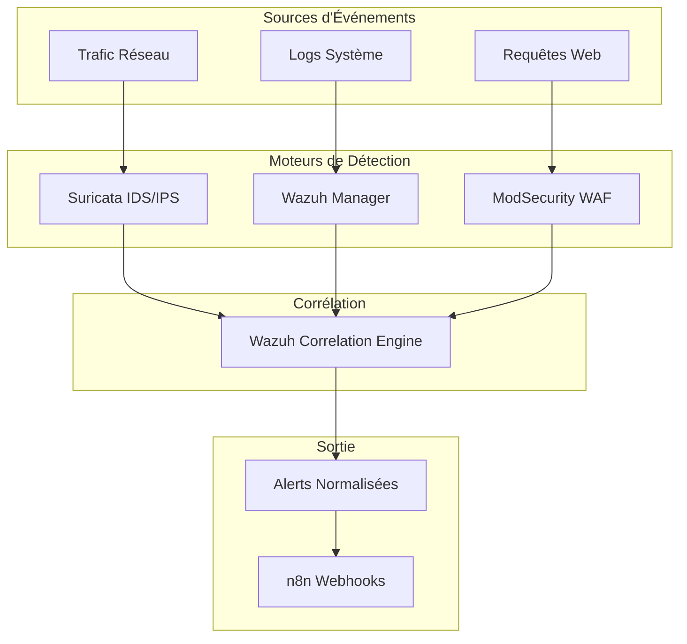

# 🔍 Couche de Détection
## Systèmes de Détection et de Monitoring

> **Section 02 - DETECTION LAYER**  
> Configuration et intégration des outils de détection

---

## 📋 Table des Matières

- [Vue d'Ensemble](#-vue-densemble)
- [Architecture de Détection](#-architecture-de-détection)
- [Composants](#-composants)

---

## 🎯 Vue d'Ensemble

La couche de détection constitue le **premier niveau** de notre architecture SOAR. Elle combine trois technologies complémentaires pour une couverture de sécurité maximale.

### Philosophie de Détection

```
┌─────────────────────────────────────────────────────────────┐
│                    DETECTION COVERAGE                       │
├─────────────────┬─────────────────┬─────────────────────────┤
│    Network      │    Endpoint     │      Web Apps           │
│   (Suricata)    │    (Wazuh)      │   (ModSecurity)         │
│                 │                 │                         │
│ • IDS/IPS       │ • HIDS          │ • WAF                   │
│ • DPI           │ • Log Analysis  │ • OWASP Protection      │
│ • Signatures    │ • Integrity     │ • Custom Rules          │
│ • Anomalies     │ • Rootkit Det   │ • Attack Prevention     │
└─────────────────┴─────────────────┴─────────────────────────┘
```

## 🏗️ Architecture de Détection

### Flux de Détection Intégré



## 🧩 Composants

### [🔍 Suricata - IDS/IPS Réseau](./suricata/)

**Rôle** : Détection d'intrusion réseau en temps réel  
**Mode** : IPS inline + IDS passif  
**Couverture** : Couche 2-7 du modèle OSI

#### Capabilities Principales
- **Signature Detection** : 30,000+ règles ET Open
- **Protocol Detection** : HTTP, DNS, TLS, SMB, etc.
- **Anomaly Detection** : Comportements suspects
- **File Extraction** : Malware, PCAP capture

#### Configuration Clé
[Visualisez le code](../../Suricta/suricata.yaml)
```yaml
%YAML 1.1
---

vars:
  address-groups:
    HOME_NET: "[192.168.15.0/24]"
    EXTERNAL_NET: "!$HOME_NET"
    HTTP_SERVERS: "$HOME_NET"
    SMTP_SERVERS: "$HOME_NET"
    SQL_SERVERS: "$HOME_NET"
    DNS_SERVERS: "$HOME_NET"
    TELNET_SERVERS: "$HOME_NET"
    AIM_SERVERS: "$EXTERNAL_NET"

  port-groups:
    HTTP_PORTS: "80"
    SHELLCODE_PORTS: "!80"
    ORACLE_PORTS: 1521
    SSH_PORTS: 22

runmode: autofp
...
```

#### Intégration SOAR
- **Output** : JSON logs vers Wazuh  
- **Alerting** : Webhook vers n8n
- **PCAP** : Extraction automatique pour analyse

---

### [📊 Wazuh - SIEM Central](./wazuh/)

**Rôle** : Système central de gestion des logs et corrélation  
**Architecture** : Manager + Indexer + Dashboard  
**Agents** : Windows, Linux, macOS

#### Capabilities Principales
- **Log Collection** : 500+ types de logs
- **Rule Engine** : 3,000+ règles OOTB  
- **Correlation** : Multi-event correlation
- **Compliance** : PCI-DSS, HIPAA, NIST

#### Agents Déployés
| Agent | Système | Rôle |
|-------|---------|------|
| Windows Agent | Endpoints | Sysmon, EventLog |
| Linux Agent | Servers | Syslog, Auth logs |
| ModSecurity Agent | WAF Container | Web attacks |

#### Configuration Manager
```xml
<ossec_config>
  <!-- Other config -->
 <integration>
  <name>custom-dns-integration</name>
  <hook_url>http://sbihi.soar.ma:5678/webhook/wazuh-sysmon</hook_url>
  <level>3</level>
  <group>sysmon_event_22</group>
  <alert_format>json</alert_format>
</integration>


<integration>
 <name>custom-ssh-webhook</name>
  <hook_url>http://sbihi.soar.ma:5678/webhook/wazuh-ssh</hook_url>
  <level>3</level>
  <alert_format>json</alert_format>
  <rule_id>40111,60122,5758,2502,5710,5760,5763,5503</rule_id>
</integration>
    <!-- Other config -->

</ossec_config>
```

#### Custom Decoders
- **ModSecurity Decoder** : Parse WAF logs
- **Suricata Decoder** : IDS alert enrichment

---

### [🛡️ ModSecurity - Web Application Firewall](./modsecurity/)

**Rôle** : Protection des applications web  
**Mode** : Detection + Prevention  
**Engine** : libmodsecurity 3.0.8

#### Capabilities Principales
- **OWASP CRS** : Core Rule Set v3.3
- **Custom Rules** : Application-specific
- **Real-time Blocking** : Immediate response
- **Detailed Logging** : Full transaction logs

#### Protection Coverage
```
┌─────────────────────────────────────┐
│            OWASP Top 10             │
├─────────────────────────────────────┤
│ ✅ A01 - Injection                  │
│ ✅ A02 - Broken Authentication      │  
│ ✅ A03 - Sensitive Data Exposure    │
│ ✅ A04 - XXE                        │
│ ✅ A05 - Broken Access Control      │
│ ✅ A06 - Security Misconfig         │
│ ✅ A07 - Cross-Site Scripting       │
│ ✅ A08 - Insecure Deserialization   │
│ ✅ A09 - Known Vulnerabilities      │
│ ✅ A10 - Insufficient Logging       │
└─────────────────────────────────────┘
```

#### Configuration Principale

```conf
#----------- Other config
SecRule REQUEST_HEADERS:X-Forwarded-For "@rx ." \
    "id:900100,phase:1,pass,log,msg:'X-Forwarded-For header detected: %{REQUEST_HEADERS.X-Forwarded-For}'"

# Log when we detect real IP header for debugging  
SecRule REQUEST_HEADERS:X-Real-IP "@rx ." \
    "id:900101,phase:1,pass,log,msg:'X-Real-IP header detected: %{REQUEST_HEADERS.X-Real-IP}'"

# Log Docker bridge traffic detection
SecRule REMOTE_ADDR "@ipMatch 172.20.0.0/16" \
    "id:900102,phase:1,pass,log,msg:'Docker bridge traffic detected from: %{REMOTE_ADDR}'"

# Log when real attacker IP is detected (from WiFi network)
SecRule REMOTE_ADDR "@rx ^192\.168\.1\." \
    "id:900103,phase:1,pass,log,msg:'Real attacker IP detected: %{REMOTE_ADDR}'"
# Enable XML request body parser.
# Initiate XML Processor in case of xml content-type
#
SecRule REQUEST_HEADERS:Content-Type "^(?:application(?:/soap\+|/)|text/)xml" \
     "id:'200000',phase:1,t:none,t:lowercase,pass,nolog,ctl:requestBodyProcessor=XML"

# Enable JSON request body parser.
# Initiate JSON Processor in case of JSON content-type; change accordingly
# if your application does not use 'application/json'
#
SecRule REQUEST_HEADERS:Content-Type "^application/json" \
     "id:'200001',phase:1,t:none,t:lowercase,pass,nolog,ctl:requestBodyProcessor=JSON"

#----------- Other config
```


## 📚 Documentation Détaillée

- **[Configuration Suricata](./suricata/README.md)** 
- **[Setup Wazuh](./wazuh/README.md)**
- **[ModSecurity Rules](./modsecurity/README.md)**
- **[Troubleshooting Guide](../07_DOCUMENTATION/troubleshooting/)**

---


**Mise à jour** : Août 2025 - Med10S
