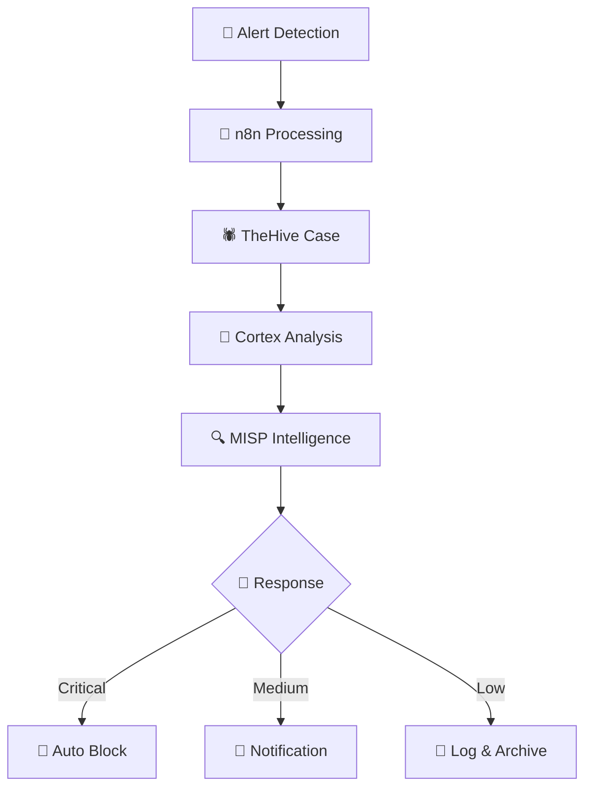

# 🤖 SOAR Stack Configuration
## Security Orchestration, Automation and Response

> **Complete SOAR Platform**  
> TheHive + Cortex + MISP + n8n for security automation  

---

## 🎯 Overview

Our SOAR stack automates security incident response by orchestrating detection tools, malware analysis, threat intelligence, and remediation actions.

### 🏗️ Components

| Component | Role | Documentation | Status |
|-----------|------|---------------|--------|
| **🤖 n8n** | Workflow Automation | [📖 n8n README](./n8n/README.md) | ✅ Operational |
| **🕷️ TheHive** | Case Management | [📖 TheHive README](./thehive/README.md) | ✅ Operational |
| **🧠 Cortex** | Analysis Engine | [📖 Cortex README](./cortex/README.md) | ✅ Operational |
| **🔍 MISP** | Threat Intelligence | [📖 MISP README](./misp/README.md) | ✅ Operational |

### 🌐 Services URLs

- **n8n Workflows** : http://sbihi.soar.ma:5678
- **TheHive Cases** : http://thehive.sbihi.soar.ma
- **Cortex Analysis** : http://cortex.sbihi.soar.ma
- **MISP Intelligence** : http://misp.sbihi.soar.ma

### 📁 Production Configuration

**Full Configuration** : [SOAR_SERVER](../../../SOAR_SERVER/)

## 🔄 SOAR Workflow



### 📊 Automation Metrics

| Workflow | Daily Alerts | Response Time | Success Rate |
|----------|-------------|---------------|-------------|
| **EternalBlue** | ~15 | 8.2s | 98.7% |
| **DNS Malware** | ~120 | 3.2s | 99.1% |
| **XSS Response** | ~45 | 2.1s | 97.8% |
| **SSH Monitoring** | ~200 | 1.8s | 99.5% |

## 🚀 Quick Deployment

### 1. Infrastructure Setup
```bash
# Navigate to SOAR Server
cd ../../../SOAR_SERVER/

# Start core services
docker-compose up -d
```

### 2. Component Configuration
Each component has detailed setup instructions:
- [🤖 n8n Setup](./n8n/README.md#configuration)
- [🕷️ TheHive Setup](./thehive/README.md#configuration)
- [🧠 Cortex Setup](./cortex/README.md#configuration)
- [🔍 MISP Setup](./misp/README.md#configuration)

## 🔗 Related Documentation

### 📚 Project Structure
- [🏗️ Architecture Overview](../01_ARCHITECTURE/README.md)
- [🔍 Detection Layer](../02_DETECTION_LAYER/README.md)
- [⚔️ Attack Scenarios](../04_ATTACK_SCENARIOS/README.md)
- [📖 Full Documentation](../07_DOCUMENTATION/README.md)

### 🛠️ Integration Guides
- [Wazuh SIEM Integration](../02_DETECTION_LAYER/wazuh/README.md)
- [Suricata IDS Integration](../02_DETECTION_LAYER/suricata/README.md)
- [Data Flow Architecture](../01_ARCHITECTURE/data_flows/README.md)

---

**🚀 Quick Start**: Begin with [n8n README](./n8n/README.md) for workflow automation  
**📞 Support**: See [Documentation](../07_DOCUMENTATION/README.md) for troubleshooting  
**📅 Last Updated**: August 2025 - Production Configuration
