# 🔗 Intégrations et API
## Connecteurs et Interopérabilité

> **Hub d'Intégration SOAR**  
> APIs, Webhooks et Connecteurs pour l'écosystème sécurité  

---

## 📋 Table des Matières

- [Vue d'Ensemble](#-vue-densemble)
- [Intégrations API](#-intégrations-api)
- [Webhooks](#-webhooks)
- [Connecteurs Réseau](#-connecteurs-réseau)
- [Scripts d'Automatisation](#-scripts-dautomatisation)
- [Monitoring des Intégrations](#-monitoring-des-intégrations)

---

## 🎯 Vue d'Ensemble

Cette section documente toutes les intégrations entre les composants du stack SOAR, permettant l'interopérabilité et l'automatisation des flux de sécurité.

### Architecture d'Intégration

```mermaid
graph TB
    A[Détection Layer] --> B[Webhook Gateway]
    B --> C[n8n Orchestrator]
    
    C --> D[TheHive API]
    C --> E[Cortex API]
    C --> F[MISP API]
    C --> G[OPNsense API]
    
    D --> H[Case Management]
    E --> I[Analysis Engine]
    F --> J[Threat Intelligence]
    G --> K[Firewall Control]
    
    L[External Services] --> M[Email/Slack]
    C --> L
    
    N[Database Layer] --> O[Elasticsearch]
    H --> N
    I --> N
    J --> N
```



### Matrice d'Intégration

| Source | Destination | Méthode | Port | Authentification | Status |
|--------|------------|---------|------|------------------|--------|
| **Wazuh** | n8n | Webhook | 5678 | API Key | ✅ |
| **Suricata** | n8n | Webhook | 5678 | API Key | ✅ |
| **ModSecurity** | n8n | Webhook | 5678 | API Key | ✅ |
| **n8n** | TheHive | REST API | 9000 | Bearer Token | ✅ |
| **n8n** | Cortex | REST API | 9001 | Bearer Token | ✅ |
| **n8n** | MISP | REST API | 443 | API Key | ✅ |
| **n8n** | OPNsense | REST API | 443 | Basic Auth | ✅ |
| **TheHive** | Cortex | REST API | 9001 | API Key | ✅ |
| **TheHive** | MISP | REST API | 443 | API Key | ✅ |

## 🔧 Intégrations API

### TheHive API Integration

#### Configuration de Base
```python
#!/usr/bin/env python3
# thehive_integration.py

import requests
import json
from datetime import datetime

class TheHiveAPI:
    def __init__(self, url, api_key):
        self.url = url.rstrip('/')
        self.headers = {
            'Authorization': f'Bearer {api_key}',
            'Content-Type': 'application/json'
        }
        self.session = requests.Session()
        self.session.headers.update(self.headers)
    
    def create_case(self, title, description, severity=2, tlp=2, pap=2, tags=None):
        """Créer un nouveau cas dans TheHive"""
        
        case_data = {
            'title': title,
            'description': description,
            'severity': severity,
            'tlp': tlp,
            'pap': pap,
            'tags': tags or [],
            'template': self._get_template_by_tags(tags or [])
        }
        
        try:
            response = self.session.post(f'{self.url}/api/case', 
                                       json=case_data)
            response.raise_for_status()
            
            case = response.json()
            print(f"[+] Case created: {case['id']} - {title}")
            return case
            
        except requests.exceptions.RequestException as e:
            print(f"[-] Error creating case: {e}")
            return None
    
    def add_observable(self, case_id, data_type, data, message='', tags=None, ioc=False):
        """Ajouter un observable à un cas"""
        
        observable_data = {
            'dataType': data_type,
            'data': data,
            'message': message,
            'tags': tags or [],
            'ioc': ioc,
            'sighted': True
        }
        
        try:
            response = self.session.post(
                f'{self.url}/api/case/{case_id}/artifact',
                json=observable_data
            )
            response.raise_for_status()
            
            observable = response.json()
            print(f"[+] Observable added: {data_type}={data}")
            return observable
            
        except requests.exceptions.RequestException as e:
            print(f"[-] Error adding observable: {e}")
            return None
    
    def update_case_status(self, case_id, status):
        """Mettre à jour le statut d'un cas"""
        
        update_data = {'status': status}
        
        try:
            response = self.session.patch(
                f'{self.url}/api/case/{case_id}',
                json=update_data
            )
            response.raise_for_status()
            
            print(f"[+] Case {case_id} status updated to: {status}")
            return response.json()
            
        except requests.exceptions.RequestException as e:
            print(f"[-] Error updating case status: {e}")
            return None
    
    def create_task(self, case_id, title, description, assignee=None):
        """Créer une tâche dans un cas"""
        
        task_data = {
            'title': title,
            'description': description,
            'status': 'Waiting'
        }
        
        if assignee:
            task_data['assignee'] = assignee
        
        try:
            response = self.session.post(
                f'{self.url}/api/case/{case_id}/task',
                json=task_data
            )
            response.raise_for_status()
            
            task = response.json()
            print(f"[+] Task created: {title}")
            return task
            
        except requests.exceptions.RequestException as e:
            print(f"[-] Error creating task: {e}")
            return None
    
    def _get_template_by_tags(self, tags):
        """Déterminer le template basé sur les tags"""
        
        if 'eternalblue' in tags:
            return 'EternalBlue Incident'
        elif 'xss' in tags:
            return 'XSS Attack Response'
        elif 'malware' in tags:
            return 'Malware Investigation'
        else:
            return 'Generic Security Incident'

# Exemple d'utilisation
def main():
    # Configuration API TheHive
    thehive = TheHiveAPI('http://192.168.15.2:9000', 'YOUR_API_KEY')
    
    # Créer un cas d'incident EternalBlue
    case = thehive.create_case(
        title='EternalBlue Detection - 192.168.183.10',
        description='Automated detection of EternalBlue exploit attempt',
        severity=3,
        tags=['eternalblue', 'smb', 'exploit', 'automated']
    )
    
    if case:
        case_id = case['id']
        
        # Ajouter des observables
        thehive.add_observable(case_id, 'ip', '192.168.183.100', 
                              'Source IP of attack', ['malicious', 'source'], ioc=True)
        
        thehive.add_observable(case_id, 'ip', '192.168.183.10', 
                              'Target IP', ['victim', 'target'])
        
        # Créer des tâches
        thehive.create_task(case_id, 'Initial Analysis', 
                           'Analyze the attack vector and impact')
        
        thehive.create_task(case_id, 'Containment', 
                           'Block malicious IP and isolate victim')
        
        print(f"[+] Incident response workflow initiated for case: {case_id}")

if __name__ == "__main__":
    main()
```

### Cortex API Integration

#### Analyzer Execution
```python
#!/usr/bin/env python3
# cortex_integration.py

import requests
import json
import time

class CortexAPI:
    def __init__(self, url, api_key):
        self.url = url.rstrip('/')
        self.headers = {
            'Authorization': f'Bearer {api_key}',
            'Content-Type': 'application/json'
        }
        self.session = requests.Session()
        self.session.headers.update(self.headers)
    
    def run_analyzer(self, analyzer_id, data_type, data, tlp=2):
        """Exécuter un analyzer sur une observable"""
        
        job_data = {
            'data': data,
            'dataType': data_type,
            'tlp': tlp
        }
        
        try:
            response = self.session.post(
                f'{self.url}/api/analyzer/{analyzer_id}/run',
                json=job_data
            )
            response.raise_for_status()
            
            job = response.json()
            job_id = job['id']
            
            print(f"[+] Analyzer job started: {job_id}")
            
            # Attendre la completion
            return self.wait_for_job_completion(job_id)
            
        except requests.exceptions.RequestException as e:
            print(f"[-] Error running analyzer: {e}")
            return None
    
    def wait_for_job_completion(self, job_id, timeout=300):
        """Attendre la completion d'un job"""
        
        start_time = time.time()
        
        while time.time() - start_time < timeout:
            try:
                response = self.session.get(f'{self.url}/api/job/{job_id}')
                response.raise_for_status()
                
                job = response.json()
                status = job.get('status')
                
                if status == 'Success':
                    print(f"[+] Job {job_id} completed successfully")
                    return self.get_job_report(job_id)
                elif status == 'Failure':
                    print(f"[-] Job {job_id} failed")
                    return None
                
                time.sleep(5)  # Check every 5 seconds
                
            except requests.exceptions.RequestException as e:
                print(f"[-] Error checking job status: {e}")
                return None
        
        print(f"[-] Job {job_id} timed out")
        return None
    
    def get_job_report(self, job_id):
        """Récupérer le rapport d'un job"""
        
        try:
            response = self.session.get(f'{self.url}/api/job/{job_id}/report')
            response.raise_for_status()
            
            report = response.json()
            return report
            
        except requests.exceptions.RequestException as e:
            print(f"[-] Error getting job report: {e}")
            return None
    
    def bulk_analysis(self, observables):
        """Analyser multiple observables en parallèle"""
        
        jobs = []
        
        for observable in observables:
            data = observable['data']
            data_type = observable['dataType']
            
            # Déterminer quels analyzers utiliser
            analyzers = self._get_analyzers_for_datatype(data_type)
            
            for analyzer in analyzers:
                job = self.run_analyzer(analyzer, data_type, data)
                if job:
                    jobs.append({
                        'job_id': job['id'] if isinstance(job, dict) else None,
                        'observable': data,
                        'analyzer': analyzer,
                        'result': job
                    })
        
        return jobs
    
    def _get_analyzers_for_datatype(self, data_type):
        """Déterminer les analyzers appropriés par type de donnée"""
        
        analyzer_mapping = {
            'ip': ['VirusTotal_GetReport', 'Shodan_Info', 'MaxMind_GeoIP', 'MISP_Lookup'],
            'domain': ['VirusTotal_GetReport', 'MISP_Lookup', 'DomainTools_Whois'],
            'hash': ['VirusTotal_GetReport', 'MISP_Lookup', 'Malware_Config_Extractor'],
            'url': ['VirusTotal_GetReport', 'URLVoid', 'MISP_Lookup'],
            'file': ['VirusTotal_GetReport', 'Yara', 'File_Info']
        }
        
        return analyzer_mapping.get(data_type, [])

# Intégration avec TheHive
def analyze_case_observables(thehive_api, cortex_api, case_id):
    """Analyser toutes les observables d'un cas TheHive"""
    
    try:
        # Récupérer les observables du cas
        response = thehive_api.session.get(f'{thehive_api.url}/api/case/{case_id}/artifact')
        response.raise_for_status()
        
        observables = response.json()
        
        print(f"[+] Found {len(observables)} observables to analyze")
        
        # Lancer l'analyse en masse
        analysis_jobs = cortex_api.bulk_analysis(observables)
        
        # Traiter les résultats
        for job in analysis_jobs:
            if job['result']:
                print(f"[+] Analysis completed for {job['observable']}: {job['analyzer']}")
                
                # Ajouter les résultats comme tags ou observables supplémentaires
                result_summary = extract_key_findings(job['result'])
                
                # Mettre à jour l'observable avec les résultats
                if result_summary.get('malicious'):
                    thehive_api.add_observable(
                        case_id, 
                        'other', 
                        f"Malicious indicator confirmed by {job['analyzer']}: {result_summary['details']}",
                        'Analysis Result',
                        ['malicious', 'confirmed']
                    )
        
        return analysis_jobs
        
    except Exception as e:
        print(f"[-] Error analyzing case observables: {e}")
        return []

def extract_key_findings(analysis_result):
    """Extraire les findings clés d'un résultat d'analyse"""
    
    findings = {
        'malicious': False,
        'score': 0,
        'details': '',
        'iocs': []
    }
    
    if isinstance(analysis_result, dict):
        report = analysis_result.get('report', {})
        
        # VirusTotal results
        if 'positives' in report and 'total' in report:
            positives = report['positives']
            total = report['total']
            
            if positives > 0:
                findings['malicious'] = True
                findings['score'] = (positives / total) * 100
                findings['details'] = f"Detected by {positives}/{total} engines"
        
        # MISP results
        if 'Event' in report:
            findings['malicious'] = True
            findings['details'] = "Found in MISP threat intelligence"
        
        # Shodan results
        if 'ports' in report:
            open_ports = len(report['ports'])
            findings['details'] = f"Found {open_ports} open ports"
    
    return findings
```

### MISP API Integration

#### Threat Intelligence Lookup
```python
#!/usr/bin/env python3
# misp_integration.py

import requests
import json
from pymisp import PyMISP

class MISPIntegration:
    def __init__(self, url, api_key, verifycert=False):
        self.misp = PyMISP(url, api_key, verifycert)
        self.url = url
        self.api_key = api_key
    
    def search_iocs(self, ioc_value, ioc_type=None):
        """Rechercher des IOCs dans MISP"""
        
        try:
            search_result = self.misp.search_index(
                value=ioc_value,
                type_attribute=ioc_type
            )
            
            if search_result:
                print(f"[+] Found {len(search_result)} matches for {ioc_value}")
                return self._process_search_results(search_result)
            else:
                print(f"[-] No matches found for {ioc_value}")
                return None
                
        except Exception as e:
            print(f"[-] Error searching MISP: {e}")
            return None
    
    def create_event_from_case(self, case_data, observables):
        """Créer un événement MISP depuis un cas TheHive"""
        
        try:
            # Créer l'événement
            event = self.misp.new_event(
                distribution=2,  # Connected communities
                threat_level_id=self._map_severity_to_threat_level(case_data.get('severity', 2)),
                analysis=1,  # Initial
                info=f"SOAR Detection: {case_data['title']}"
            )
            
            event_id = event['Event']['id']
            
            # Ajouter les tags
            tags = case_data.get('tags', [])
            for tag in tags:
                self.misp.tag(event['Event']['uuid'], tag)
            
            # Ajouter les observables
            for obs in observables:
                self._add_observable_to_event(event_id, obs)
            
            print(f"[+] MISP event created: {event_id}")
            return event
            
        except Exception as e:
            print(f"[-] Error creating MISP event: {e}")
            return None
    
    def enrich_with_context(self, ioc_value, ioc_type):
        """Enrichir un IOC avec le contexte MISP"""
        
        context = {
            'threat_actors': [],
            'campaigns': [],
            'malware_families': [],
            'attack_patterns': []
        }
        
        try:
            # Rechercher l'IOC
            search_results = self.search_iocs(ioc_value, ioc_type)
            
            if search_results:
                for result in search_results:
                    event = self.misp.get_event(result['event_id'])
                    
                    if event:
                        event_data = event['Event']
                        
                        # Extraire les threat actors
                        for tag in event_data.get('Tag', []):
                            tag_name = tag['name'].lower()
                            
                            if 'apt:' in tag_name or 'actor:' in tag_name:
                                context['threat_actors'].append(tag['name'])
                            elif 'campaign:' in tag_name:
                                context['campaigns'].append(tag['name'])
                            elif 'malware:' in tag_name:
                                context['malware_families'].append(tag['name'])
                            elif 'mitre-attack:' in tag_name:
                                context['attack_patterns'].append(tag['name'])
            
            return context
            
        except Exception as e:
            print(f"[-] Error enriching with MISP context: {e}")
            return context
    
    def _add_observable_to_event(self, event_id, observable):
        """Ajouter une observable à un événement MISP"""
        
        data_type = observable['dataType']
        data_value = observable['data']
        
        try:
            if data_type == 'ip':
                self.misp.add_ip_dst(event_id, data_value, 
                                   comment=observable.get('message', ''),
                                   to_ids=True)
            elif data_type == 'domain':
                self.misp.add_domain(event_id, data_value,
                                   comment=observable.get('message', ''),
                                   to_ids=True)
            elif data_type == 'hash':
                if len(data_value) == 32:  # MD5
                    self.misp.add_hashes(event_id, md5=data_value,
                                       comment=observable.get('message', ''))
                elif len(data_value) == 64:  # SHA256
                    self.misp.add_hashes(event_id, sha256=data_value,
                                       comment=observable.get('message', ''))
            elif data_type == 'url':
                self.misp.add_url(event_id, data_value,
                                comment=observable.get('message', ''))
                
        except Exception as e:
            print(f"[-] Error adding observable to MISP: {e}")
    
    def _map_severity_to_threat_level(self, severity):
        """Mapper la sévérité TheHive vers le niveau de menace MISP"""
        
        mapping = {
            1: 4,  # Low -> Low
            2: 3,  # Medium -> Medium  
            3: 2,  # High -> High
            4: 1   # Critical -> High
        }
        
        return mapping.get(severity, 3)
    
    def _process_search_results(self, results):
        """Traiter les résultats de recherche MISP"""
        
        processed = []
        
        for result in results:
            processed.append({
                'event_id': result['event_id'],
                'event_info': result['info'],
                'attribute_type': result['type'],
                'attribute_value': result['value'],
                'category': result['category'],
                'timestamp': result['timestamp']
            })
        
        return processed
```

## 🔔 Webhooks

### Configuration n8n Webhooks

#### Webhook Wazuh
```javascript
// n8n webhook handler pour Wazuh
// Node: Webhook Wazuh

// Traiter l'alerte Wazuh
const wazuhAlert = $input.first().json;

// Extraire les informations clés
const alertData = {
    id: wazuhAlert.id || 'unknown',
    timestamp: wazuhAlert.timestamp || new Date().toISOString(),
    rule_id: wazuhAlert.rule?.id || 0,
    rule_description: wazuhAlert.rule?.description || 'Unknown rule',
    rule_level: wazuhAlert.rule?.level || 0,
    rule_groups: wazuhAlert.rule?.groups || [],
    agent_id: wazuhAlert.agent?.id || 'unknown',
    agent_name: wazuhAlert.agent?.name || 'unknown',
    source_ip: wazuhAlert.data?.srcip || null,
    dest_ip: wazuhAlert.data?.dstip || null,
    full_log: wazuhAlert.full_log || '',
    decoder: wazuhAlert.decoder?.name || 'unknown'
};

// Déterminer le type d'attaque
let attackType = 'unknown';
let severity = alertData.rule_level;

if (alertData.rule_groups.includes('eternalblue')) {
    attackType = 'eternalblue';
    severity = Math.max(severity, 12);
} else if (alertData.rule_groups.includes('xss')) {
    attackType = 'xss';
    severity = Math.max(severity, 8);
} else if (alertData.rule_groups.includes('malware')) {
    attackType = 'malware';
    severity = Math.max(severity, 10);
}

// Enrichir avec géolocalisation si IP source disponible
let geoData = null;
if (alertData.source_ip && alertData.source_ip !== '127.0.0.1') {
    geoData = {
        ip: alertData.source_ip,
        // Sera enrichi par node suivant
    };
}

return [{
    json: {
        alert_source: 'wazuh',
        attack_type: attackType,
        severity: severity,
        alert_data: alertData,
        geo_data: geoData,
        requires_response: severity >= 10,
        timestamp: new Date().toISOString()
    }
}];
```

#### Webhook Suricata
```javascript
// n8n webhook handler pour Suricata Eve JSON
// Node: Webhook Suricata

const suricataAlert = $input.first().json;

// Vérifier que c'est bien une alerte
if (suricataAlert.event_type !== 'alert') {
    return [{
        json: {
            message: 'Not an alert event',
            event_type: suricataAlert.event_type,
            processed: false
        }
    }];
}

// Extraire les données de l'alerte
const alertData = {
    timestamp: suricataAlert.timestamp,
    flow_id: suricataAlert.flow_id,
    in_iface: suricataAlert.in_iface,
    src_ip: suricataAlert.src_ip,
    src_port: suricataAlert.src_port,
    dest_ip: suricataAlert.dest_ip,
    dest_port: suricataAlert.dest_port,
    proto: suricataAlert.proto,
    alert: {
        action: suricataAlert.alert.action,
        gid: suricataAlert.alert.gid,
        signature_id: suricataAlert.alert.signature_id,
        rev: suricataAlert.alert.rev,
        signature: suricataAlert.alert.signature,
        category: suricataAlert.alert.category,
        severity: suricataAlert.alert.severity
    }
};

// Déterminer le type d'attaque basé sur la signature
let attackType = 'ids_alert';
let criticalityScore = alertData.alert.severity;

if (alertData.alert.signature.toLowerCase().includes('eternalblue')) {
    attackType = 'eternalblue';
    criticalityScore = 1; // Critique
} else if (alertData.alert.signature.toLowerCase().includes('xss')) {
    attackType = 'xss';
    criticalityScore = 2; // Élevé
} else if (alertData.alert.signature.toLowerCase().includes('malware')) {
    attackType = 'malware';
    criticalityScore = 1; // Critique
}

// Extraire les données de payload si disponibles
let payloadData = null;
if (suricataAlert.payload_printable) {
    payloadData = {
        payload: suricataAlert.payload_printable,
        payload_base64: suricataAlert.payload
    };
}

// Extraire les données HTTP si disponibles
let httpData = null;
if (suricataAlert.http) {
    httpData = {
        hostname: suricataAlert.http.hostname,
        url: suricataAlert.http.url,
        http_user_agent: suricataAlert.http.http_user_agent,
        http_method: suricataAlert.http.http_method,
        http_refer: suricataAlert.http.http_refer,
        status: suricataAlert.http.status,
        length: suricataAlert.http.length
    };
}

return [{
    json: {
        alert_source: 'suricata',
        attack_type: attackType,
        severity: criticalityScore,
        alert_data: alertData,
        payload_data: payloadData,
        http_data: httpData,
        requires_response: criticalityScore <= 2,
        timestamp: new Date().toISOString()
    }
}];
```

#### Webhook ModSecurity
```javascript
// n8n webhook handler pour ModSecurity
// Node: Webhook ModSecurity

const modsecAlert = $input.first().json;

// Parser les logs ModSecurity
const alertData = {
    timestamp: modsecAlert.timestamp || new Date().toISOString(),
    severity: modsecAlert.severity || 'UNKNOWN',
    rule_id: modsecAlert.rule_id || 'unknown',
    rule_msg: modsecAlert.rule_msg || 'Unknown rule',
    source_ip: modsecAlert.source_ip || 'unknown',
    request_uri: modsecAlert.request_uri || '',
    request_method: modsecAlert.request_method || 'GET',
    user_agent: modsecAlert.user_agent || '',
    matched_data: modsecAlert.matched_data || '',
    matched_var: modsecAlert.matched_var || '',
    action: modsecAlert.action || 'unknown'
};

// Déterminer le type d'attaque
let attackType = 'web_attack';
let severityLevel = 5; // Default medium

if (alertData.rule_msg.toLowerCase().includes('xss')) {
    attackType = 'xss';
    severityLevel = alertData.severity === 'CRITICAL' ? 12 : 8;
} else if (alertData.rule_msg.toLowerCase().includes('sqli') || 
           alertData.rule_msg.toLowerCase().includes('sql injection')) {
    attackType = 'sqli';
    severityLevel = alertData.severity === 'CRITICAL' ? 12 : 8;
} else if (alertData.rule_msg.toLowerCase().includes('malware') ||
           alertData.rule_msg.toLowerCase().includes('webshell')) {
    attackType = 'webshell';
    severityLevel = 15;
}

// Extraire le payload de l'attaque
let payloadAnalysis = null;
if (alertData.matched_data) {
    payloadAnalysis = {
        payload: alertData.matched_data,
        variable: alertData.matched_var,
        encoding_detected: detectEncoding(alertData.matched_data),
        obfuscation_level: calculateObfuscation(alertData.matched_data)
    };
}

// Fonction helper pour détecter l'encoding
function detectEncoding(payload) {
    const encodings = [];
    
    if (payload.includes('%')) encodings.push('url_encoded');
    if (payload.includes('&lt;') || payload.includes('&gt;')) encodings.push('html_encoded');
    if (payload.includes('\\x')) encodings.push('hex_encoded');
    if (payload.includes('\\u')) encodings.push('unicode_encoded');
    
    return encodings;
}

// Fonction helper pour calculer le niveau d'obfuscation
function calculateObfuscation(payload) {
    let score = 0;
    
    if (payload.includes('eval(')) score += 3;
    if (payload.includes('atob(') || payload.includes('btoa(')) score += 2;
    if (payload.match(/\\x[0-9a-f]{2}/gi)) score += 2;
    if (payload.includes('String.fromCharCode')) score += 3;
    if (payload.match(/%[0-9a-f]{2}/gi)) score += 1;
    
    return Math.min(score, 10); // Max 10
}

return [{
    json: {
        alert_source: 'modsecurity',
        attack_type: attackType,
        severity: severityLevel,
        alert_data: alertData,
        payload_analysis: payloadAnalysis,
        requires_response: severityLevel >= 10,
        blocked: alertData.action === 'BLOCKED',
        timestamp: new Date().toISOString()
    }
}];
```

## 🌐 Connecteurs Réseau

### OPNsense Firewall Integration

#### Script de Blocage IP
```python
#!/usr/bin/env python3
# opnsense_connector.py

import requests
import json
import base64
from urllib3.exceptions import InsecureRequestWarning

# Désactiver les warnings SSL pour les tests
requests.packages.urllib3.disable_warnings(category=InsecureRequestWarning)

class OPNsenseConnector:
    def __init__(self, host, api_key, api_secret):
        self.host = host
        self.api_key = api_key
        self.api_secret = api_secret
        
        # Créer l'authentification Basic Auth
        credentials = f"{api_key}:{api_secret}"
        encoded_credentials = base64.b64encode(credentials.encode()).decode()
        
        self.headers = {
            'Authorization': f'Basic {encoded_credentials}',
            'Content-Type': 'application/json'
        }
        
        self.session = requests.Session()
        self.session.headers.update(self.headers)
        self.session.verify = False  # Pour les environnements de test
    
    def block_ip(self, ip_address, alias_name='SOAR_Blocked_IPs'):
        """Bloquer une adresse IP via alias OPNsense"""
        
        try:
            # Étape 1: Ajouter l'IP à l'alias
            add_url = f"https://{self.host}/api/firewall/alias/addHost/{alias_name}"
            add_data = {"host": ip_address}
            
            response = self.session.post(add_url, json=add_data)
            
            if response.status_code == 200:
                print(f"[+] IP {ip_address} added to alias {alias_name}")
                
                # Étape 2: Recharger les alias
                reload_url = f"https://{self.host}/api/firewall/alias/reconfigure"
                reload_response = self.session.post(reload_url)
                
                if reload_response.status_code == 200:
                    print(f"[+] Firewall rules reloaded")
                    return True
                else:
                    print(f"[-] Failed to reload rules: {reload_response.status_code}")
                    return False
            else:
                print(f"[-] Failed to add IP: {response.status_code} - {response.text}")
                return False
                
        except Exception as e:
            print(f"[-] Error blocking IP: {e}")
            return False
    
    def unblock_ip(self, ip_address, alias_name='SOAR_Blocked_IPs'):
        """Débloquer une adresse IP"""
        
        try:
            # Étape 1: Retirer l'IP de l'alias
            remove_url = f"https://{self.host}/api/firewall/alias/delHost/{alias_name}"
            remove_data = {"host": ip_address}
            
            response = self.session.post(remove_url, json=remove_data)
            
            if response.status_code == 200:
                print(f"[+] IP {ip_address} removed from alias {alias_name}")
                
                # Étape 2: Recharger les alias
                reload_url = f"https://{self.host}/api/firewall/alias/reconfigure"
                reload_response = self.session.post(reload_url)
                
                if reload_response.status_code == 200:
                    print(f"[+] Firewall rules reloaded")
                    return True
                    
            return False
            
        except Exception as e:
            print(f"[-] Error unblocking IP: {e}")
            return False
    
    def get_blocked_ips(self, alias_name='SOAR_Blocked_IPs'):
        """Récupérer la liste des IPs bloquées"""
        
        try:
            url = f"https://{self.host}/api/firewall/alias/searchItem"
            
            response = self.session.get(url)
            
            if response.status_code == 200:
                data = response.json()
                
                # Filtrer pour l'alias spécifique
                blocked_ips = []
                for row in data.get('rows', []):
                    if row.get('name') == alias_name:
                        content = row.get('content', '')
                        blocked_ips = [ip.strip() for ip in content.split('\n') if ip.strip()]
                        break
                
                return blocked_ips
            else:
                print(f"[-] Failed to get blocked IPs: {response.status_code}")
                return []
                
        except Exception as e:
            print(f"[-] Error getting blocked IPs: {e}")
            return []
    
    def create_firewall_rule(self, rule_data):
        """Créer une règle de firewall"""
        
        try:
            url = f"https://{self.host}/api/firewall/filter/addRule"
            
            response = self.session.post(url, json=rule_data)
            
            if response.status_code == 200:
                result = response.json()
                rule_uuid = result.get('uuid')
                
                if rule_uuid:
                    print(f"[+] Firewall rule created: {rule_uuid}")
                    
                    # Appliquer les changements
                    apply_url = f"https://{self.host}/api/firewall/filter/apply"
                    apply_response = self.session.post(apply_url)
                    
                    if apply_response.status_code == 200:
                        print(f"[+] Firewall rules applied")
                        return rule_uuid
                
            return None
            
        except Exception as e:
            print(f"[-] Error creating firewall rule: {e}")
            return None

# Script d'intégration n8n
def n8n_opnsense_integration():
    """Script appelé par n8n pour bloquer des IPs"""
    
    import sys
    
    if len(sys.argv) < 2:
        print("Usage: python opnsense_connector.py <ip_to_block>")
        sys.exit(1)
    
    ip_to_block = sys.argv[1]
    
    # Configuration OPNsense
    opnsense = OPNsenseConnector(
        host='192.168.181.1',
        api_key='YOUR_API_KEY',
        api_secret='YOUR_API_SECRET'
    )
    
    # Bloquer l'IP
    success = opnsense.block_ip(ip_to_block)
    
    # Retourner le résultat pour n8n
    result = {
        'ip_blocked': ip_to_block,
        'success': success,
        'timestamp': datetime.now().isoformat()
    }
    
    print(json.dumps(result))

if __name__ == "__main__":
    n8n_opnsense_integration()
```

## 🔍 Scripts d'Automatisation

### Orchestration Master Script
```python
#!/usr/bin/env python3
# soar_orchestrator.py

import asyncio
import aiohttp
import json
from datetime import datetime
import logging

# Configuration du logging
logging.basicConfig(level=logging.INFO, format='%(asctime)s - %(levelname)s - %(message)s')
logger = logging.getLogger(__name__)

class SOAROrchestrator:
    def __init__(self, config_file='soar_config.json'):
        self.config = self.load_config(config_file)
        self.session = None
        
    def load_config(self, config_file):
        """Charger la configuration depuis un fichier JSON"""
        
        try:
            with open(config_file, 'r') as f:
                return json.load(f)
        except FileNotFoundError:
            # Configuration par défaut
            return {
                'thehive': {
                    'url': 'http://192.168.15.2:9000',
                    'api_key': 'YOUR_THEHIVE_API_KEY'
                },
                'cortex': {
                    'url': 'http://192.168.15.2:9001', 
                    'api_key': 'YOUR_CORTEX_API_KEY'
                },
                'misp': {
                    'url': 'http://192.168.15.5',
                    'api_key': 'YOUR_MISP_API_KEY'
                },
                'opnsense': {
                    'host': '192.168.181.1',
                    'api_key': 'YOUR_OPNSENSE_API_KEY',
                    'api_secret': 'YOUR_OPNSENSE_API_SECRET'
                },
                'notifications': {
                    'email': {
                        'smtp_server': 'smtp.gmail.com',
                        'smtp_port': 587,
                        'username': 'alerts@soar.lab',
                        'password': 'your_password',
                        'recipients': ['soc@soar.lab']
                    },
                    'slack': {
                        'webhook_url': 'https://hooks.slack.com/services/...'
                    }
                }
            }
    
    async def process_alert(self, alert_data):
        """Traiter une alerte de sécurité"""
        
        logger.info(f"Processing alert: {alert_data.get('attack_type', 'unknown')}")
        
        try:
            # Étape 1: Créer un cas TheHive
            case = await self.create_thehive_case(alert_data)
            
            if not case:
                logger.error("Failed to create TheHive case")
                return
            
            case_id = case['id']
            logger.info(f"Created case: {case_id}")
            
            # Étape 2: Analyser avec Cortex
            analysis_results = await self.run_cortex_analysis(alert_data, case_id)
            
            # Étape 3: Enrichir avec MISP
            misp_data = await self.enrich_with_misp(alert_data)
            
            # Étape 4: Déterminer la réponse automatique
            response_action = self.determine_response_action(alert_data, analysis_results, misp_data)
            
            # Étape 5: Exécuter la réponse
            if response_action:
                await self.execute_response(response_action, alert_data, case_id)
            
            # Étape 6: Notifier
            await self.send_notifications(alert_data, case_id, response_action)
            
            logger.info(f"Alert processing completed for case: {case_id}")
            
        except Exception as e:
            logger.error(f"Error processing alert: {e}")
    
    async def create_thehive_case(self, alert_data):
        """Créer un cas dans TheHive"""
        
        case_data = {
            'title': f"{alert_data['attack_type'].upper()} - {alert_data['alert_data'].get('source_ip', 'Unknown IP')}",
            'description': f"Automated detection by {alert_data['alert_source']}",
            'severity': min(alert_data['severity'] // 3 + 1, 4),  # Convertir en 1-4
            'tlp': 2,
            'pap': 2,
            'tags': [alert_data['attack_type'], alert_data['alert_source'], 'automated']
        }
        
        headers = {
            'Authorization': f"Bearer {self.config['thehive']['api_key']}",
            'Content-Type': 'application/json'
        }
        
        async with self.session.post(
            f"{self.config['thehive']['url']}/api/case",
            json=case_data,
            headers=headers
        ) as response:
            if response.status == 201:
                return await response.json()
            else:
                logger.error(f"Failed to create case: {response.status}")
                return None
    
    async def run_cortex_analysis(self, alert_data, case_id):
        """Lancer l'analyse Cortex"""
        
        # Extraire les observables de l'alerte
        observables = self.extract_observables(alert_data)
        
        analysis_jobs = []
        
        for observable in observables:
            # Lancer l'analyse pour chaque observable
            job = await self.submit_cortex_job(observable)
            if job:
                analysis_jobs.append(job)
        
        # Attendre les résultats
        results = []
        for job in analysis_jobs:
            result = await self.wait_for_cortex_result(job['id'])
            if result:
                results.append(result)
        
        return results
    
    def extract_observables(self, alert_data):
        """Extraire les observables d'une alerte"""
        
        observables = []
        data = alert_data.get('alert_data', {})
        
        # IP source
        if data.get('source_ip') or data.get('src_ip'):
            ip = data.get('source_ip') or data.get('src_ip')
            if ip and ip != '127.0.0.1':
                observables.append({
                    'dataType': 'ip',
                    'data': ip,
                    'message': 'Source IP from alert'
                })
        
        # Domaine/hostname
        if alert_data.get('http_data', {}).get('hostname'):
            observables.append({
                'dataType': 'domain',
                'data': alert_data['http_data']['hostname'],
                'message': 'Hostname from HTTP traffic'
            })
        
        # Hash de fichier si disponible
        if data.get('file_hash'):
            observables.append({
                'dataType': 'hash',
                'data': data['file_hash'],
                'message': 'File hash from detection'
            })
        
        return observables
    
    def determine_response_action(self, alert_data, analysis_results, misp_data):
        """Déterminer l'action de réponse automatique"""
        
        severity = alert_data['severity']
        attack_type = alert_data['attack_type']
        
        # Score de criticité basé sur plusieurs facteurs
        criticality_score = severity
        
        # Ajuster selon les résultats d'analyse
        for result in analysis_results:
            if result.get('malicious'):
                criticality_score += 5
        
        # Ajuster selon MISP
        if misp_data.get('found_in_misp'):
            criticality_score += 3
        
        # Déterminer l'action
        if criticality_score >= 15:
            return {
                'action': 'auto_block',
                'target': alert_data['alert_data'].get('source_ip') or alert_data['alert_data'].get('src_ip'),
                'reason': 'Critical threat detected',
                'duration': 3600  # 1 heure
            }
        elif criticality_score >= 10:
            return {
                'action': 'quarantine',
                'target': alert_data['alert_data'].get('source_ip') or alert_data['alert_data'].get('src_ip'),
                'reason': 'High risk threat',
                'duration': 1800  # 30 minutes
            }
        else:
            return {
                'action': 'monitor',
                'target': alert_data['alert_data'].get('source_ip') or alert_data['alert_data'].get('src_ip'),
                'reason': 'Medium/Low risk - monitoring'
            }
    
    async def execute_response(self, response_action, alert_data, case_id):
        """Exécuter l'action de réponse"""
        
        action_type = response_action['action']
        target_ip = response_action['target']
        
        if action_type in ['auto_block', 'quarantine'] and target_ip:
            # Bloquer via OPNsense
            success = await self.block_ip_opnsense(target_ip)
            
            if success:
                # Mettre à jour le cas TheHive
                await self.update_case_status(case_id, f"IP {target_ip} blocked automatically")
                
                # Programmer le déblocage si temporaire
                if response_action.get('duration'):
                    await self.schedule_ip_unblock(target_ip, response_action['duration'])
            
            logger.info(f"Response executed: {action_type} for {target_ip}")
    
    async def block_ip_opnsense(self, ip_address):
        """Bloquer une IP via OPNsense"""
        
        # Utiliser le connecteur OPNsense
        try:
            # Implementation du blocage
            # (Utilise le code OPNsenseConnector vu précédemment)
            return True
        except Exception as e:
            logger.error(f"Failed to block IP {ip_address}: {e}")
            return False
    
    async def send_notifications(self, alert_data, case_id, response_action):
        """Envoyer les notifications"""
        
        message = f"""
        🚨 SOAR Alert Processed

        Attack Type: {alert_data['attack_type'].upper()}
        Severity: {alert_data['severity']}
        Source: {alert_data['alert_source']}
        Case ID: {case_id}
        
        Response Action: {response_action['action'] if response_action else 'None'}
        
        Timestamp: {datetime.now().isoformat()}
        """
        
        # Envoyer email
        await self.send_email_notification(message)
        
        # Envoyer Slack
        await self.send_slack_notification(message)
    
    async def send_email_notification(self, message):
        """Envoyer notification email"""
        # Implementation de l'envoi d'email
        pass
    
    async def send_slack_notification(self, message):
        """Envoyer notification Slack"""
        # Implementation de l'envoi Slack
        pass
    
    async def run(self):
        """Démarrer l'orchestrateur"""
        
        self.session = aiohttp.ClientSession()
        
        try:
            # Écouter les alertes (webhook ou queue)
            await self.listen_for_alerts()
        finally:
            await self.session.close()

# Point d'entrée
if __name__ == "__main__":
    orchestrator = SOAROrchestrator()
    asyncio.run(orchestrator.run())
```

## 📊 Monitoring des Intégrations

### Health Check Dashboard
```python
#!/usr/bin/env python3
# integration_health_check.py

import asyncio
import aiohttp
import json
from datetime import datetime

class IntegrationHealthChecker:
    def __init__(self):
        self.services = {
            'thehive': {'url': 'http://192.168.15.2:9000/api/status', 'method': 'GET'},
            'cortex': {'url': 'http://192.168.15.2:9001/api/status', 'method': 'GET'},
            'misp': {'url': 'http://192.168.15.5/servers/getVersion.json', 'method': 'GET'},
            'elasticsearch': {'url': 'http://192.168.15.2:9200/_cluster/health', 'method': 'GET'},
            'n8n': {'url': 'http://192.168.15.3:5678/healthz', 'method': 'GET'},
            'wazuh': {'url': 'http://192.168.15.2:55000/agents/summary/status', 'method': 'GET'},
            'opnsense': {'url': 'https://192.168.181.1/api/diagnostics/interface/getInterfaceStatistics', 'method': 'GET'}
        }
        
        self.results = {}
    
    async def check_service_health(self, session, service_name, service_config):
        """Vérifier la santé d'un service"""
        
        try:
            timeout = aiohttp.ClientTimeout(total=10)
            
            async with session.request(
                service_config['method'],
                service_config['url'],
                timeout=timeout,
                ssl=False
            ) as response:
                
                status = 'UP' if response.status == 200 else 'DOWN'
                
                self.results[service_name] = {
                    'status': status,
                    'response_code': response.status,
                    'response_time': response.headers.get('X-Response-Time', 'N/A'),
                    'timestamp': datetime.now().isoformat()
                }
                
        except asyncio.TimeoutError:
            self.results[service_name] = {
                'status': 'TIMEOUT',
                'response_code': 0,
                'error': 'Request timed out',
                'timestamp': datetime.now().isoformat()
            }
        except Exception as e:
            self.results[service_name] = {
                'status': 'ERROR',
                'response_code': 0,
                'error': str(e),
                'timestamp': datetime.now().isoformat()
            }
    
    async def run_health_checks(self):
        """Exécuter tous les checks de santé"""
        
        async with aiohttp.ClientSession() as session:
            tasks = []
            
            for service_name, service_config in self.services.items():
                task = self.check_service_health(session, service_name, service_config)
                tasks.append(task)
            
            await asyncio.gather(*tasks)
        
        return self.results
    
    def generate_html_report(self):
        """Générer un rapport HTML"""
        
        html = """
        <!DOCTYPE html>
        <html>
        <head>
            <title>SOAR Integration Health Check</title>
            <style>
                body { font-family: Arial, sans-serif; margin: 20px; }
                .service { margin: 10px 0; padding: 10px; border-radius: 5px; }
                .UP { background-color: #d4edda; border-left: 5px solid #28a745; }
                .DOWN { background-color: #f8d7da; border-left: 5px solid #dc3545; }
                .TIMEOUT { background-color: #fff3cd; border-left: 5px solid #ffc107; }
                .ERROR { background-color: #f8d7da; border-left: 5px solid #dc3545; }
            </style>
        </head>
        <body>
            <h1>🔍 SOAR Integration Health Check</h1>
            <p>Last updated: """ + datetime.now().strftime('%Y-%m-%d %H:%M:%S') + """</p>
        """
        
        for service_name, result in self.results.items():
            status_class = result['status']
            html += f"""
            <div class="service {status_class}">
                <h3>{service_name.upper()}</h3>
                <p><strong>Status:</strong> {result['status']}</p>
                <p><strong>Response Code:</strong> {result['response_code']}</p>
                <p><strong>Timestamp:</strong> {result['timestamp']}</p>
                {f"<p><strong>Error:</strong> {result['error']}</p>" if 'error' in result else ''}
            </div>
            """
        
        html += """
        </body>
        </html>
        """
        
        with open('/tmp/soar_health_report.html', 'w') as f:
            f.write(html)
        
        print("[+] Health report generated: /tmp/soar_health_report.html")

# Exécution
async def main():
    checker = IntegrationHealthChecker()
    results = await checker.run_health_checks()
    
    # Affichage console
    print("\n🔍 SOAR Integration Health Check Results")
    print("=" * 50)
    
    for service, result in results.items():
        status_emoji = "✅" if result['status'] == 'UP' else "❌"
        print(f"{status_emoji} {service.upper()}: {result['status']}")
    
    # Générer rapport HTML
    checker.generate_html_report()
    
    # Retourner résultats JSON
    with open('/tmp/soar_health_results.json', 'w') as f:
        json.dump(results, f, indent=2)

if __name__ == "__main__":
    asyncio.run(main())
```

---

## 🔗 Références

- **[n8n Documentation](https://docs.n8n.io/)**
- **[TheHive API Documentation](https://docs.thehive-project.org/thehive/api/)**
- **[Cortex API Documentation](https://docs.thehive-project.org/cortex/api/)**
- **[MISP API Documentation](https://misp.gitbooks.io/misp-book/content/automation/)**
- **[OPNsense API Documentation](https://docs.opnsense.org/development/api.html)**

### Fichiers de Configuration

Les scripts d'intégration sont disponibles dans les sous-dossiers :
- **📂 [api_scripts/](./api_scripts/)**
- **📂 [webhooks/](./webhooks/)**

---
**Mise à jour** : Août 2025 - Med10S
