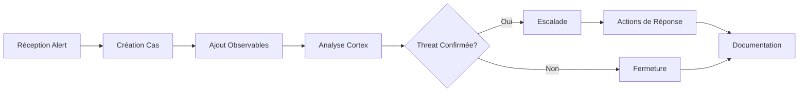

# 📚 Documentation et Guides

## Vue d'Ensemble de la Documentation

Cette section centralise toute la documentation technique, les guides de troubleshooting et les ressources d'apprentissage de la plateforme SOAR.

---

## 📋 Structure de la Documentation

```
07_DOCUMENTATION/
├── troubleshooting/           # Guides de dépannage
├── user_guides/              # Guides utilisateur
├── api_references/           # Références des APIs
├── best_practices/           # Bonnes pratiques
└── training_materials/       # Matériel de formation
```

---

## 🔧 Guides de Dépannage

### Problèmes Courants et Solutions

#### Wazuh Manager
```bash
# Problème : Wazuh ne démarre pas
sudo systemctl status wazuh-manager

# Solutions courantes :
# 1. Vérifier les logs
sudo tail -f /var/ossec/logs/ossec.log

# 2. Vérifier la configuration
sudo /var/ossec/bin/wazuh-control start

# 3. Réinstaller si nécessaire
sudo apt-get purge wazuh-manager
sudo apt-get install wazuh-manager
```

#### TheHive Connection Issues
```javascript
// Problème : TheHive API ne répond pas
// Vérification 1: Service actif
curl -v http://localhost:9000/api/status

// Vérification 2: Configuration Elasticsearch
curl -X GET "localhost:9200/_cluster/health?pretty"

// Solution : Redémarrer les services dans l'ordre
sudo systemctl restart elasticsearch
sleep 30
sudo systemctl restart thehive
```

#### n8n Workflow Errors
```javascript
// Problème : Webhooks n8n inaccessibles
// Vérification des ports
netstat -tlnp | grep 5678

// Test de connectivité
curl -X POST http://localhost:5678/webhook/test \
  -H "Content-Type: application/json" \
  -d '{"test": "data"}'

// Redémarrage avec logs
docker logs n8n --follow
```

#### Cortex Analyzer Failures
```bash
# Problème : Analyseurs ne s'exécutent pas
# Vérifier les logs Cortex
sudo tail -f /var/log/cortex/application.log

# Vérifier la connectivité Elasticsearch
curl -X GET "localhost:9200/cortex/_search?pretty"

# Relancer un analyseur manuellement
curl -X POST "http://localhost:9001/api/analyzer/VirusTotal_GetReport_3_0/run" \
  -H "Authorization: Bearer YOUR_API_KEY" \
  -H "Content-Type: application/json" \
  -d '{"data": "malicious-domain.com", "dataType": "domain"}'
```

#### MISP Synchronization Issues
```php
// Problème : MISP feeds ne se synchronisent pas
// Vérifier les feeds via interface web ou CLI

// Via ligne de commande
cd /var/www/MISP/app/Console
sudo -u www-data ./cake Server pullAll

// Vérifier les logs
sudo tail -f /var/www/MISP/app/tmp/logs/error.log

// Test de connectivité réseau
wget -O- https://www.circl.lu/doc/misp/feed-osint/manifest.json
```

### Monitoring et Performance

#### Script de Diagnostic Complet
```bash
#!/bin/bash
# diagnostic_soar.sh

echo "🔍 Diagnostic SOAR Platform"
echo "=========================="

# Vérifier l'espace disque
echo -e "\n💾 Espace Disque:"
df -h | grep -E "(/$|/var|/opt)"

# Vérifier la RAM
echo -e "\n🧠 Utilisation Mémoire:"
free -h

# Vérifier les services
echo -e "\n🔧 État des Services:"
services=("elasticsearch" "thehive" "cortex" "wazuh-manager" "apache2")
for service in "${services[@]}"; do
    if systemctl is-active --quiet "$service"; then
        echo "✅ $service: Actif"
    else
        echo "❌ $service: Inactif"
    fi
done

# Vérifier les ports
echo -e "\n🌐 Ports Ouverts:"
netstat -tlnp | grep -E "(9000|9001|9200|5678|55000|80|443)"

# Tester la connectivité des APIs
echo -e "\n🔗 Test APIs:"
apis=("elasticsearch:9200" "thehive:9000" "cortex:9001" "n8n:5678")
for api in "${apis[@]}"; do
    IFS=':' read -r name port <<< "$api"
    if curl -s --connect-timeout 3 "http://localhost:$port" >/dev/null; then
        echo "✅ $name: Accessible"
    else
        echo "❌ $name: Inaccessible"
    fi
done

# Vérifier les logs d'erreur récents
echo -e "\n📋 Erreurs Récentes:"
echo "=== TheHive ==="
sudo tail -5 /var/log/thehive/application.log | grep -i error || echo "Aucune erreur récente"

echo "=== Cortex ==="
sudo tail -5 /var/log/cortex/application.log | grep -i error || echo "Aucune erreur récente"

echo "=== Wazuh ==="
sudo tail -5 /var/ossec/logs/ossec.log | grep -i error || echo "Aucune erreur récente"

echo -e "\n✅ Diagnostic terminé"
```

---

## 📖 Guides Utilisateur

### Guide d'Utilisation TheHive

#### Création d'un Cas
```markdown
1. **Accéder à TheHive** : http://localhost:9000
2. **Connexion** : admin / secret (changer au premier usage)
3. **Nouveau Cas** :
   - Cliquer sur "+" dans la barre latérale
   - Remplir les champs obligatoires :
     * Titre : Description courte du cas
     * Sévérité : 1 (Low) à 4 (Critical)
     * TLP : Traffic Light Protocol (White/Green/Amber/Red)
   - Ajouter des tags pertinents
4. **Ajouter des Observables** :
   - IP addresses, domaines, hashes, URLs
   - Marquer comme IOC si nécessaire
5. **Créer des Tâches** :
   - Définir les actions à mener
   - Assigner aux analystes
   - Suivre l'avancement
```

#### Workflow d'Investigation


### Guide d'Utilisation Cortex

#### Configuration des Analyseurs
```javascript
// 1. Accéder à Cortex : http://localhost:9001
// 2. Organization Settings > Analyzers
// 3. Activer les analyseurs requis :

const requiredAnalyzers = {
  "VirusTotal_GetReport_3_0": {
    "config": {
      "key": "YOUR_VIRUSTOTAL_API_KEY",
      "auto_extract_artifacts": true
    }
  },
  "MISP_2_1": {
    "config": {
      "url": "http://localhost/misp",
      "key": "YOUR_MISP_API_KEY"
    }
  },
  "Shodan_DNSResolve_1_0": {
    "config": {
      "key": "YOUR_SHODAN_API_KEY"
    }
  }
};

// 4. Tester la configuration
// 5. Définir les seuils d'alerte
```

### Guide d'Utilisation n8n

#### Création de Workflows
```markdown
1. **Accéder à n8n** : http://localhost:5678
2. **Nouveau Workflow** :
   - Drag & Drop des nodes
   - Configurer les connexions
   - Tester chaque étape
3. **Nodes Essentiels** :
   - Webhook : Point d'entrée
   - HTTP Request : APIs externes
   - IF : Logique conditionnelle
   - Function : Code JavaScript personnalisé
4. **Meilleures Pratiques** :
   - Nommer clairement les nodes
   - Ajouter des commentaires
   - Gérer les erreurs
   - Tester avec des données réelles
```

---

## 🔧 Références API

### TheHive API

#### Authentification
```javascript
const theHiveConfig = {
  url: 'http://localhost:9000',
  headers: {
    'Authorization': 'Bearer YOUR_API_KEY',
    'Content-Type': 'application/json'
  }
};
```

#### Endpoints Principaux
```javascript
// Créer un cas
POST /api/case
{
  "title": "Security Incident",
  "description": "Description détaillée",
  "severity": 2,
  "tlp": 2,
  "tags": ["malware", "phishing"]
}

// Ajouter un observable
POST /api/case/{caseId}/artifact
{
  "dataType": "ip",
  "data": "192.168.1.100",
  "message": "IP suspecte détectée",
  "tags": ["malicious"]
}

// Créer une tâche
POST /api/case/{caseId}/task
{
  "title": "Analyse forensique",
  "description": "Analyser le malware",
  "status": "Waiting"
}
```

### Cortex API

#### Lancer une Analyse
```javascript
// Exécuter un analyseur
POST /api/analyzer/{analyzerId}/run
{
  "data": "malicious-domain.com",
  "dataType": "domain",
  "tlp": 2,
  "message": "Domain analysis"
}

// Récupérer le résultat
GET /api/job/{jobId}/report
```

### MISP API

#### Recherche d'Événements
```javascript
// Rechercher des événements
POST /events/restSearch
{
  "value": "192.168.1.100",
  "type": "ip-dst",
  "category": "Network activity"
}

// Créer un événement
POST /events
{
  "info": "SOAR Detection",
  "threat_level_id": "2",
  "analysis": "1",
  "distribution": "2"
}
```

---

## 🎯 Bonnes Pratiques

### Sécurité

#### Gestion des Clés API
```bash
# Stockage sécurisé des clés
# 1. Utiliser des variables d'environnement
export THEHIVE_API_KEY="your_secret_key"
export CORTEX_API_KEY="your_secret_key"

# 2. Fichiers de configuration protégés
sudo chmod 600 /etc/thehive/secret.conf
sudo chown thehive:thehive /etc/thehive/secret.conf

# 3. Rotation régulière des clés
# Programmer des scripts de rotation automatique
```

#### Authentification Multi-Facteur
```javascript
// Configuration MFA pour TheHive
// Dans application.conf
auth {
  providers = [
    {
      name = local
      realms = [
        {
          name = local
          type = local
        }
      ]
    },
    {
      name = ldap
      realms = [
        {
          name = ldap
          type = ldap
          serverNames = ["ldap.company.com"]
          bindDN = "cn=thehive,ou=services,dc=company,dc=com"
          bindPW = "password"
          baseDN = "ou=users,dc=company,dc=com"
          filter = "(cn={0})"
        }
      ]
    }
  ]
}
```

### Performance

#### Optimisation Elasticsearch
```bash
# Configuration mémoire
echo "ES_JAVA_OPTS=\"-Xms2g -Xmx2g\"" >> /etc/default/elasticsearch

# Optimisation index
curl -X PUT "localhost:9200/_template/thehive_template" -H 'Content-Type: application/json' -d'
{
  "index_patterns": ["thehive*"],
  "settings": {
    "number_of_shards": 1,
    "number_of_replicas": 0,
    "refresh_interval": "30s"
  }
}'
```

#### Monitoring des Performances
```javascript
// Script de monitoring n8n
const monitoringWorkflow = {
  name: "System Monitoring",
  nodes: [
    {
      name: "Schedule",
      type: "n8n-nodes-base.cron",
      parameters: {
        rule: {
          interval: "hour"
        }
      }
    },
    {
      name: "Check Services",
      type: "n8n-nodes-base.function",
      parameters: {
        functionCode: `
          const services = ['thehive', 'cortex', 'elasticsearch'];
          const results = [];
          
          for (const service of services) {
            const response = await $http.request({
              method: 'GET',
              url: \`http://localhost:9200/_cluster/health\`,
              timeout: 5000
            });
            
            results.push({
              service: service,
              status: response.status === 200 ? 'OK' : 'ERROR',
              response_time: response.responseTime
            });
          }
          
          return results.map(result => ({json: result}));
        `
      }
    }
  ]
};
```

---

## 📚 Matériel de Formation

### Curriculum SOAR

#### Module 1: Fondamentaux
- **Durée** : 2 heures
- **Objectifs** :
  - Comprendre les concepts SOAR
  - Identifier les composants de la stack
  - Navigation dans les interfaces

#### Module 2: Gestion des Incidents
- **Durée** : 4 heures
- **Objectifs** :
  - Créer et gérer des cas TheHive
  - Utiliser les observables efficacement
  - Workflow d'investigation

#### Module 3: Automatisation
- **Durée** : 6 heures
- **Objectifs** :
  - Créer des workflows n8n
  - Configurer les intégrations
  - Développer des playbooks

#### Module 4: Threat Intelligence
- **Durée** : 3 heures
- **Objectifs** :
  - Utiliser MISP efficacement
  - Analyser avec Cortex
  - Enrichissement des IOCs

### Exercices Pratiques

#### Exercice 1: Investigation Malware
```markdown
**Objectif** : Investiguer un fichier suspect

**Scenario** :
1. Réception d'un email avec pièce jointe suspecte
2. Hash MD5 : 5d41402abc4b2a76b9719d911017c592
3. IP source : 192.168.100.50

**Étapes** :
1. Créer un cas dans TheHive
2. Ajouter les observables (hash, IP)
3. Lancer les analyses Cortex
4. Enrichir avec MISP
5. Déterminer les actions de réponse
6. Documenter les findings
```

#### Exercice 2: Automatisation Réponse
```markdown
**Objectif** : Créer un workflow de blocage automatique

**Scenario** :
1. Détection d'une IP malveillante
2. Vérification automatique dans MISP
3. Blocage via OPNsense si confirmée
4. Notification équipe SOC

**Livrable** : Workflow n8n fonctionnel
```

---

## 🔗 Ressources Externes

### Documentation Officielle
- **[TheHive Documentation](https://docs.thehive-project.org/)**
- **[Cortex User Guide](https://docs.thehive-project.org/cortex/)**
- **[MISP Book](https://www.misp-project.org/documentation/)**
- **[Wazuh Documentation](https://documentation.wazuh.com/)**
- **[n8n Documentation](https://docs.n8n.io/)**

### Formations et Certifications
- **[SANS FOR578: Cyber Threat Intelligence](https://www.sans.org/cyber-security-courses/cyber-threat-intelligence/)**
- **[MISP Training Materials](https://github.com/MISP/misp-training)**
- **[TheHive Training](https://www.thehive-project.org/training/)**

### Communautés
- **[TheHive Project Discord](https://discord.gg/thehive-project)**
- **[MISP Community](https://www.misp-project.org/community/)**
- **[Wazuh Community](https://wazuh.com/community/)**

---

## 📁 Index des Ressources

```
07_DOCUMENTATION/
├── README.md                     # Ce fichier - guide principal
├── troubleshooting/
│   ├── common_issues.md          # Problèmes courants
│   ├── diagnostic_scripts.sh     # Scripts de diagnostic
│   └── performance_tuning.md     # Optimisation performances
├── user_guides/
│   ├── thehive_guide.md         # Guide utilisateur TheHive
│   ├── cortex_guide.md          # Guide utilisateur Cortex
│   ├── n8n_workflows.md         # Guide workflows n8n
│   └── misp_guide.md            # Guide utilisateur MISP
├── api_references/
│   ├── thehive_api.md           # Référence API TheHive
│   ├── cortex_api.md            # Référence API Cortex
│   └── integration_examples.md  # Exemples d'intégration
├── best_practices/
│   ├── security.md              # Bonnes pratiques sécurité
│   ├── performance.md           # Bonnes pratiques performance
│   └── incident_response.md     # Processus de réponse
└── training_materials/
    ├── curriculum.md            # Programme de formation
    ├── exercises/               # Exercices pratiques
    └── assessment.md            # Évaluations
```

---

**Documentation SOAR** : 19 Août 2025 - Med10S  
**Version** : 1.0 - Documentation complète pour formation et opérations
