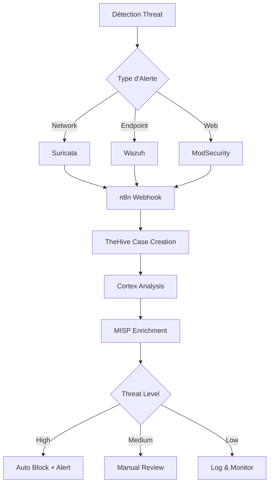

# 🛡️ CyberSecurity SIEM/SOAR Platform
## Plateforme de Détection et d'Orchestration d'Incidents de Sécurité

> **Projet d'Étude - Med10S**  
> Mise à jour : Août 2025  
> Architecture SOAR complète pour la détection et la réponse automatisée aux incidents de sécurité

---

## 📋 Vue d'Ensemble

Cette plateforme implémente un **SOC (Security Operations Center)** de niveau hospitalier utilisant une stack SIEM/SOAR intégrée. Le système détecte, analyse et répond automatiquement aux incidents de sécurité à travers une orchestration intelligente des outils de cybersécurité.

### 🎯 Objectifs du Projet
- **Détection proactive** des menaces cybernétiques
- **Orchestration automatisée** des réponses d'incidents  
- **Intégration complète** des outils de sécurité
- **Audit et conformité** (HIPAA/RGPD)

### 🏗️ Architecture Générale

```
┌─────────────────────────────────────────────────────────────┐
│                    COUCHE DE DÉTECTION                      │
├─────────────────┬─────────────────┬─────────────────────────┤
│    Suricata     │     Wazuh       │      ModSecurity        │
│   (IDS/IPS)     │   (SIEM Core)   │        (WAF)            │
└─────────────────┴─────────────────┴─────────────────────────┘
                            │
┌─────────────────────────────────────────────────────────────┐
│                   COUCHE D'ORCHESTRATION                    │
├─────────────────┬─────────────────┬─────────────────────────┤
│    TheHive      │     Cortex      │         MISP            │
│ (Case Mgmt)     │  (Analyzers)    │  (Threat Intel)         │
└─────────────────┴─────────────────┴─────────────────────────┘
                            │
┌─────────────────────────────────────────────────────────────┐
│                    COUCHE D'AUTOMATION                      │
│                         n8n                                 │
│              (Workflow Orchestration)                       │
└─────────────────────────────────────────────────────────────┘
```

## 🔍 Types d'Attaques Couvertes

| Type d'Attaque | Outil de Détection | Réponse Automatique |
|----------------|-------------------|-------------------|
| **Sites Malveillants** | Wazuh + Sysmon | Blocage DNS + Alerte |
| **EternalBlue (SMB)** | Suricata + Wazuh | Isolation réseau + Patch |
| **Cross-Site Scripting (XSS)** | ModSecurity + WAF | Blocage IP + Analyse |

## 📚 Structure de la Documentation

Cette documentation est organisée comme un cours progressif :

### [01 - ARCHITECTURE](./01_ARCHITECTURE/)
- 🏗️ Diagrammes d'architecture
- 🌐 Topologie réseau
- 🔄 Flux de données

### [02 - COUCHE DE DÉTECTION](./02_DETECTION_LAYER/)
- 🔍 **[Suricata](./02_DETECTION_LAYER/suricata/)** - IDS/IPS Network
- 📊 **[Wazuh](./02_DETECTION_LAYER/wazuh/)** - SIEM Central
- 🛡️ **[ModSecurity](./02_DETECTION_LAYER/modsecurity/)** - Web Application Firewall

### [03 - STACK SOAR](./03_SOAR_STACK/)
- 🎯 **[TheHive](./03_SOAR_STACK/thehive/)** - Gestion des Cas
- 🧠 **[Cortex](./03_SOAR_STACK/cortex/)** - Analyseurs Automatisés
- 🌍 **[MISP](./03_SOAR_STACK/misp/)** - Threat Intelligence
- ⚙️ **[n8n](./03_SOAR_STACK/n8n/)** - Orchestration des Workflows

### [04 - SCÉNARIOS D'ATTAQUE](./04_ATTACK_SCENARIOS/)
- 🌐 **[Sites Malveillants](./04_ATTACK_SCENARIOS/malicious_websites/)**
- 💥 **[EternalBlue](./04_ATTACK_SCENARIOS/eternalblue/)**
- 🔗 **[Cross-Site Scripting](./04_ATTACK_SCENARIOS/xss/)**

### [05 - INTÉGRATIONS](./05_INTEGRATIONS/)
- 🔌 Scripts API
- 🪝 Webhooks et Triggers

### [06 - DÉPLOIEMENT](./06_DEPLOYMENT/)
- 🐳 Configuration Docker
- ⚙️ Scripts d'Installation

### [07 - DOCUMENTATION](./07_DOCUMENTATION/)
- 📖 Guides Utilisateur
- 🔧 Dépannage
- 📚 Références

## 🔗 Composants Externes

Cette documentation fait référence aux composants suivants du projet :

| Composant | Emplacement | Description |
|-----------|-------------|-------------|
| **[Suricata](../Suricata/)** | `../Suricata/` | Configuration IDS/IPS |
| **[SOAR Server](../SOAR_SERVER/)** | `../SOAR_SERVER/` | Stack complète TheHive/Cortex/MISP |
| **[ModSecurity](../ModSecurity/)** | `../ModSecurity/` | WAF et protection web |
| **[Scripts](../scripts/)** | `../scripts/` | Outils d'intégration |

## 🚀 Démarrage Rapide

### Prérequis
- Docker & Docker Compose
- Accès réseau aux segments : 192.168.181.x, 192.168.15.x
- 8GB RAM minimum, 16GB recommandé

### Installation Express
```bash
# 1. Cloner le projet
git clone <repository-url>
cd Project_Pfa/

# 2. Démarrer les services principaux
cd SOAR_SERVER/
docker-compose up -d

# 3. Configurer la détection
cd ../Suricata/
./setup.sh

# 4. Déployer la protection web
cd ../ModSecurity/
docker-compose up -d
```

### Accès aux Interfaces
- **Wazuh Dashboard** : https://192.168.15.3:4443
- **TheHive** : https://192.168.15.3:9999  
- **Cortex** : https://192.168.15.3:9001
- **MISP** : https://192.168.15.3:4432
- **n8n** : https://192.168.15.3:5678

## 📊 Flux de Traitement d'Incident



## 🛠️ Technologies Utilisées

| Catégorie | Outils | Version |
|-----------|---------|---------|
| **SIEM** | Wazuh | 4.13.0-rc3 |
| **Case Management** | TheHive | Latest |
| **Analysis** | Cortex | Latest |
| **Threat Intel** | MISP | Latest |
| **IDS/IPS** | Suricata | Latest |
| **WAF** | ModSecurity | 3.0.8 |
| **Orchestration** | n8n | Latest |
| **Containerization** | Docker | 23.0+ |

## 📈 Métriques et KPIs

- **MTTR** (Mean Time To Response) : < 5 minutes
- **Détection Coverage** : 95%+ des attaques connues
- **False Positive Rate** : < 2%
- **Disponibilité** : 99.9% uptime

## 🤝 Contribution

Ce projet est développé à des fins éducatives. Les contributions sont les bienvenues :

1. **Issues** : Signaler des problèmes
2. **Pull Requests** : Proposer des améliorations  
3. **Documentation** : Améliorer les guides

## 📄 Licence

Projet éducatif - Usage libre à des fins de recherche et d'apprentissage.

---

## 🔍 Navigation Rapide

| Section | Description | Statut |
|---------|-------------|---------|
| [Architecture](./01_ARCHITECTURE/) | Diagrammes et topologie | ✅ Complet |
| [Détection](./02_DETECTION_LAYER/) | Configuration des outils de détection | ✅ Complet |
| [SOAR Stack](./03_SOAR_STACK/) | TheHive, Cortex, MISP | ✅ Complet |
| [Attaques](./04_ATTACK_SCENARIOS/) | Scénarios de test | 🚧 En cours |
| [Intégrations](./05_INTEGRATIONS/) | APIs et webhooks | ✅ Complet |
| [Déploiement](./06_DEPLOYMENT/) | Installation et config | ✅ Complet |
| [Documentation](./07_DOCUMENTATION/) | Guides utilisateur | 🚧 En cours |

> **Note** : Cette documentation est mise à jour régulièrement. Consultez le changelog pour les dernières modifications.

---
**Développé par Med10S** - Projet d'Étude en Cybersécurité - 2025
