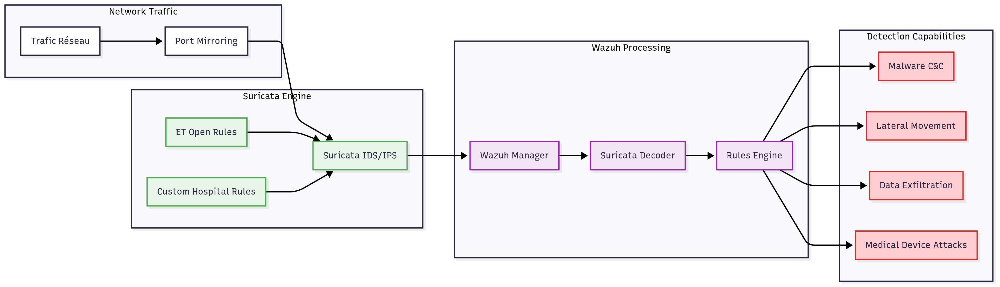

# Architecture Détaillée SIEM/SOAR - Équipe de Sécurité Hospitalière

## Vue d'ensemble

Cette architecture est conçue spécifiquement pour **une équipe de sécurité/RSSI** gérant la cybersécurité d'un environnement hospitalier. L'objectif est de maximiser la visibilité, la détection et la réponse aux incidents de sécurité avec une stack unifiée.

## 🎯 **Architecture Centrée Sécurité**

### **Stack SIEM Pure - Wazuh Platform**
```
🔍 SIEM Central
├── Wazuh Manager - Collecte & Analyse
├── Wazuh Indexer (OpenSearch) - Stockage Sécurisé
└── Wazuh Dashboard - Interface SOC Dédiée
```

### **SOAR Platform - Orchestration**
```
🤖 Réponse Automatisée
├── TheHive - Gestion Incidents & Cases
├── Cortex - Analyse Automatisée & Enrichissement
└── MISP - Threat Intelligence & IOCs
```

## Wazuh : Le Cœur du SIEM

### Capacités Principales de Wazuh

#### 1. Host-based Intrusion Detection System (HIDS)
- **Monitoring en temps réel** des fichiers système
- **Détection d'intégrité** (FIM - File Integrity Monitoring)
- **Analyse comportementale** des processus
- **Rootkit detection** et anti-malware

#### 2. Log Data Analysis
- **Parsing intelligent** de 500+ formats de logs
- **Corrélation événements** multi-sources
- **Enrichissement automatique** des données
- **Machine learning** pour détection d'anomalies

#### 3. Compliance et Conformité
- **HIPAA compliance** native
- **PCI DSS** monitoring automatique
- **GDPR/RGPD** audit trails
- **SOX reporting** intégré

## Intégrations Stratégiques de Wazuh

### 1. Wazuh + Suricata : Détection Réseau Avancée





**Configuration Suricata-Wazuh :**
```yaml
# /var/ossec/etc/ossec.conf
<localfile>
    <log_format>json</log_format>
    <location>/var/log/suricata/eve.json</location>
</localfile>

```

## Détection Spécialisée par Type d'Attaque

### 1. Brute Force Detection

**Wazuh Rules Configuration :**
```xml
<rule id="100001" level="10">
    <if_matched_sid>5710</if_matched_sid>
    <same_source_ip />
    <different_user />
    <time_frame>300</time_frame>
    <count>5</count>
    <description>Multiple failed login attempts from same IP (Brute Force)</description>
    <group>authentication_failures,brute_force</group>
</rule>

<rule id="100002" level="12">
    <if_matched_sid>100001</if_matched_sid>
    <same_source_ip />
    <time_frame>600</time_frame>
    <count>3</count>
    <description>Persistent brute force attack detected</description>
    <group>brute_force,attack</group>
</rule>
```

**Intégrations :**
- **Suricata** : Détection réseau des tentatives
- **Elastic ML** : Modèles d'apprentissage pour patterns
- **TheHive** : Création automatique de cas
- **AbuseIPDB** : Vérification réputation IP via Cortex

### 2. XSS Detection

**Multi-layer Detection :**
```xml
<rule id="100010" level="7">
    <decoded_as>web-accesslog</decoded_as>
    <regex type="pcre2">(?i)(script|javascript|vbscript|onload|onerror)</regex>
    <description>Possible XSS attack detected in web logs</description>
    <group>web,attack,xss</group>
</rule>

<rule id="100011" level="10">
    <if_matched_sid>100010</if_matched_sid>
    <regex type="pcre2">(?i)&lt;script|javascript:|vbscript:|onload=|onerror=</regex>
    <description>XSS attack detected - malicious script injection</description>
    <group>web,attack,xss</group>
</rule>
```

**Stack Integration :**
- **Web Application Firewall** logs → Wazuh
- **Application logs** → Logstash → Elasticsearch
- **Suricata** → Network pattern detection
- **Cortex** → URL/Domain reputation check


Cette architecture offre une solution complète, évolutive et adaptée aux contraintes spécifiques des environnements hospitaliers, avec une focus particulier sur la détection d'attaques sophistiquées et la conformité réglementaire.
YARA