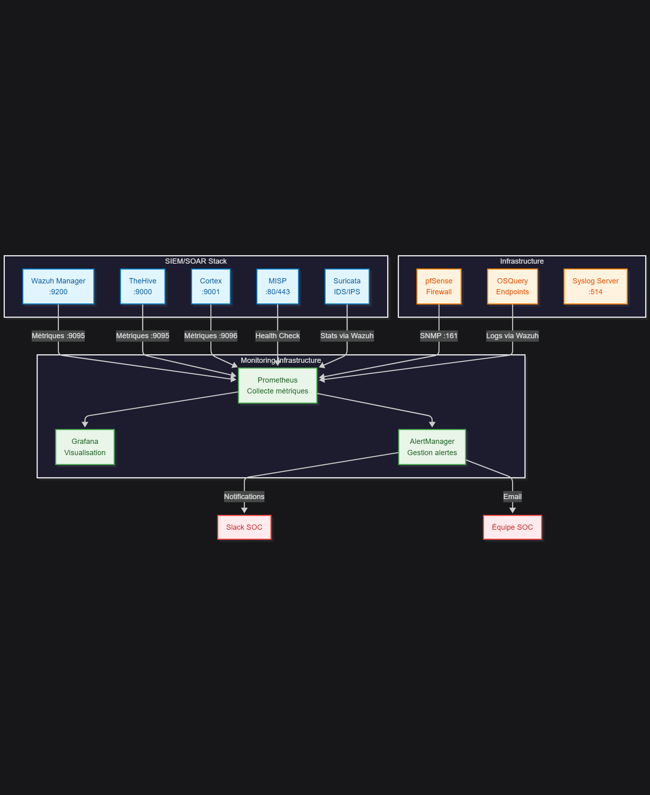

# Guide de Maintenance et Monitoring - SOC Hospitalier

## Vue d'ensemble

Ce guide présente les procédures de maintenance préventive et de monitoring continu pour la stack SIEM/SOAR hospitalière. Il couvre la surveillance des performances, les mises à jour de sécurité, et les procédures de maintenance pour assurer une disponibilité optimale.

## Architecture de Monitoring



## 1. Métriques de Performance Clés

### 1.1 Métriques Wazuh
```yaml
# Métriques critiques à surveiller
wazuh_metrics:
  performance:
    - events_per_second
    - queue_size
    - memory_usage
    - cpu_utilization
    - disk_usage
  
  security:
    - alerts_per_minute
    - high_severity_alerts
    - rule_efficiency
    - agent_connectivity
  
  availability:
    - service_uptime
    - response_time
    - cluster_health
    - replication_lag
```

### 1.2 Métriques TheHive
```yaml
thehive_metrics:
  cases:
    - open_cases_count
    - case_creation_rate
    - case_closure_time
    - sla_compliance
  
  performance:
    - response_time
    - database_size
    - memory_usage
    - concurrent_users
  
  integration:
    - cortex_connectivity
    - misp_sync_status
    - webhook_success_rate
```

### 1.3 Métriques Cortex
```yaml
cortex_metrics:
  jobs:
    - job_queue_size
    - job_success_rate
    - job_execution_time
    - analyzer_availability
  
  analyzers:
    - analyzer_response_time
    - error_rate_by_analyzer
    - api_quota_usage
    - cache_hit_rate
  
  responders:
    - response_execution_time
    - action_success_rate
    - integration_health
```

## 2. Dashboards Grafana

### 2.1 Dashboard SOC Overview
```json
{
  "dashboard": {
    "title": "SOC Hospital - Vue d'ensemble",
    "panels": [
      {
        "title": "Alertes Critiques (24h)",
        "type": "stat",
        "targets": [
          {
            "expr": "sum(wazuh_alerts{severity=\"critical\"}[24h])"
          }
        ]
      },
      {
        "title": "Santé des Services",
        "type": "stat",
        "targets": [
          {
            "expr": "up{job=~\"wazuh|thehive|cortex|misp\"}"
          }
        ]
      },
      {
        "title": "Événements par Minute",
        "type": "graph",
        "targets": [
          {
            "expr": "rate(wazuh_events_total[5m])*60"
          }
        ]
      }
    ]
  }
}
```

### 2.2 Dashboard Performance
```json
{
  "dashboard": {
    "title": "SOC Hospital - Performance",
    "panels": [
      {
        "title": "Utilisation CPU",
        "type": "graph",
        "targets": [
          {
            "expr": "100 - (avg(irate(node_cpu_seconds_total{mode=\"idle\"}[5m])) * 100)"
          }
        ]
      },
      {
        "title": "Utilisation Mémoire",
        "type": "graph",
        "targets": [
          {
            "expr": "(1 - (node_memory_MemAvailable_bytes / node_memory_MemTotal_bytes)) * 100"
          }
        ]
      },
      {
        "title": "Espace Disque",
        "type": "graph",
        "targets": [
          {
            "expr": "100 - ((node_filesystem_avail_bytes * 100) / node_filesystem_size_bytes)"
          }
        ]
      }
    ]
  }
}
```

## 3. Alertes et Seuils

### 3.1 Configuration AlertManager
```yaml
# /etc/alertmanager/alertmanager.yml
global:
  smtp_smarthost: 'smtp.hospital.local:587'
  smtp_from: 'alertmanager@hospital.local'
  smtp_auth_username: 'alertmanager@hospital.local'
  smtp_auth_password: 'smtp_password'

route:
  group_by: ['alertname', 'severity']
  group_wait: 10s
  group_interval: 10s
  repeat_interval: 12h
  receiver: 'soc-team'
  
  routes:
  - match:
      severity: critical
    receiver: 'soc-critical'
    continue: true
  
  - match:
      service: medical-device
    receiver: 'medical-team'
    continue: true

receivers:
- name: 'soc-team'
  email_configs:
  - to: 'soc@hospital.local'
    subject: '[SOC] {{ .GroupLabels.alertname }}'
    body: |
      {{ range .Alerts }}
      Alerte: {{ .Annotations.summary }}
      Description: {{ .Annotations.description }}
      Sévérité: {{ .Labels.severity }}
      Service: {{ .Labels.service }}
      Heure: {{ .StartsAt.Format "2006-01-02 15:04:05" }}
      {{ end }}

- name: 'soc-critical'
  slack_configs:
  - api_url: 'https://hooks.slack.com/services/HOSPITAL/SOC/CRITICAL'
    channel: '#soc-critical'
    title: 'ALERTE CRITIQUE - {{ .GroupLabels.alertname }}'
    text: '{{ range .Alerts }}{{ .Annotations.description }}{{ end }}'
  
  email_configs:
  - to: 'soc-manager@hospital.local'
    subject: '[CRITIQUE] {{ .GroupLabels.alertname }}'

- name: 'medical-team'
  email_configs:
  - to: 'medical-it@hospital.local'
    subject: '[MEDICAL] {{ .GroupLabels.alertname }}'
```

### 3.2 Règles d'Alerte Prometheus
```yaml
# /etc/prometheus/rules/soc_alerts.yml
groups:
- name: soc.rules
  rules:
  
  # Service Down
  - alert: ServiceDown
    expr: up == 0
    for: 1m
    labels:
      severity: critical
    annotations:
      summary: "Service {{ $labels.job }} down"
      description: "{{ $labels.instance }} of job {{ $labels.job }} has been down for more than 1 minute."
  
  # Wazuh High CPU
  - alert: WazuhHighCPU
    expr: rate(process_cpu_seconds_total{job="wazuh"}[5m]) * 100 > 80
    for: 5m
    labels:
      severity: warning
      service: wazuh
    annotations:
      summary: "Wazuh high CPU usage"
      description: "Wazuh CPU usage is above 80% for 5 minutes."
  
  # TheHive Database Size
  - alert: TheHiveDatabaseSize
    expr: thehive_database_size_bytes > 50000000000  # 50GB
    for: 1m
    labels:
      severity: warning
      service: thehive
    annotations:
      summary: "TheHive database size warning"
      description: "TheHive database size is over 50GB."
  
  # Critical Alerts Threshold
  - alert: HighCriticalAlerts
    expr: increase(wazuh_alerts{severity="critical"}[1h]) > 50
    for: 1m
    labels:
      severity: critical
      service: wazuh
    annotations:
      summary: "High number of critical alerts"
      description: "More than 50 critical alerts in the last hour."
  
  # Medical Device Compromise
  - alert: MedicalDeviceCompromise
    expr: increase(wazuh_alerts{rule_group="medical_device"}[5m]) > 0
    for: 0s
    labels:
      severity: critical
      service: medical-device
    annotations:
      summary: "Medical device compromise detected"
      description: "Suspicious activity detected on medical devices."
```

## 4. Maintenance Préventive

### 4.1 Checklist Quotidienne
```bash
#!/bin/bash
# daily_maintenance.sh - Maintenance quotidienne automatisée

LOG_FILE="/var/log/soc/daily_maintenance.log"
DATE=$(date '+%Y-%m-%d %H:%M:%S')

echo "[$DATE] Début maintenance quotidienne" >> $LOG_FILE

# Vérification des services
systemctl is-active wazuh-manager >> $LOG_FILE
systemctl is-active thehive >> $LOG_FILE
systemctl is-active cortex >> $LOG_FILE

# Vérification espace disque
df -h | grep -E "(wazuh|thehive|cortex)" >> $LOG_FILE

# Vérification logs d'erreur
grep -i error /var/log/wazuh/wazuh.log | tail -10 >> $LOG_FILE
grep -i error /var/log/thehive/thehive.log | tail -10 >> $LOG_FILE

# Nettoyage logs anciens
find /var/log/wazuh -name "*.log.gz" -mtime +30 -delete
find /var/log/thehive -name "*.log.gz" -mtime +30 -delete

# Sauvegarde configurations
tar -czf /backup/configs/config_$(date +%Y%m%d).tar.gz \
  /var/ossec/etc \
  /etc/thehive \
  /etc/cortex

echo "[$DATE] Fin maintenance quotidienne" >> $LOG_FILE
```

### 4.2 Checklist Hebdomadaire
```bash
#!/bin/bash
# weekly_maintenance.sh - Maintenance hebdomadaire

# Mise à jour règles Wazuh
/var/ossec/bin/update_ruleset

# Mise à jour base MISP
cd /var/www/MISP && sudo -u www-data php console/cake Server.fetchUpdates

# Optimisation base de données TheHive
curl -X POST "http://localhost:9000/api/maintenance/optimize"

# Analyse performances
iostat -x 1 10 > /var/log/soc/iostat_$(date +%Y%m%d).log
vmstat 1 10 > /var/log/soc/vmstat_$(date +%Y%m%d).log

# Test connectivité externe
for url in virustotal.com abuseipdb.com; do
  curl -I $url >> /var/log/soc/connectivity_$(date +%Y%m%d).log 2>&1
done
```

### 4.3 Checklist Mensuelle
```bash
#!/bin/bash
# monthly_maintenance.sh - Maintenance mensuelle

# Mise à jour sécurité système
apt update && apt upgrade -y

# Vérification intégrité
aide --check

# Analyse performances avancée
sar -A > /var/log/soc/sar_$(date +%Y%m).log

# Test de restauration
/opt/scripts/test_backup_restore.sh

# Révision des règles de corrélation
/opt/scripts/review_correlation_rules.sh

# Génération rapport mensuel
/opt/scripts/generate_monthly_report.sh
```

## 5. Procédures de Sauvegarde

### 5.1 Script de Sauvegarde Automatisée
```bash
#!/bin/bash
# backup_soc_stack.sh - Sauvegarde complète

BACKUP_DIR="/backup/soc"
DATE=$(date +%Y%m%d_%H%M%S)
RETENTION_DAYS=30

# Création répertoire de sauvegarde
mkdir -p $BACKUP_DIR/$DATE

# Sauvegarde Wazuh
tar -czf $BACKUP_DIR/$DATE/wazuh_$DATE.tar.gz \
  /var/ossec/etc \
  /var/ossec/rules \
  /var/ossec/ruleset

# Sauvegarde TheHive
systemctl stop thehive
tar -czf $BACKUP_DIR/$DATE/thehive_$DATE.tar.gz \
  /opt/thehive/database \
  /etc/thehive
systemctl start thehive

# Sauvegarde Cortex
systemctl stop cortex
tar -czf $BACKUP_DIR/$DATE/cortex_$DATE.tar.gz \
  /opt/cortex/database \
  /etc/cortex
systemctl start cortex

# Sauvegarde MISP
mysqldump misp > $BACKUP_DIR/$DATE/misp_db_$DATE.sql
tar -czf $BACKUP_DIR/$DATE/misp_files_$DATE.tar.gz \
  /var/www/MISP/app/files

# Nettoyage anciennes sauvegardes
find $BACKUP_DIR -mtime +$RETENTION_DAYS -exec rm -rf {} \;

# Vérification intégrité
cd $BACKUP_DIR/$DATE
sha256sum *.tar.gz *.sql > checksums.txt
```

## 6. Gestion des Incidents de Maintenance

### 6.1 Procédure d'Escalade
```yaml
escalation_matrix:
  niveau_1:
    description: "Alerte automatique"
    action: "Notification Slack + Email"
    timeout: "5 minutes"
    
  niveau_2:
    description: "Intervention technicien"
    action: "Appel automatique"
    timeout: "15 minutes"
    
  niveau_3:
    description: "Astreinte manager"
    action: "SMS + Appel"
    timeout: "30 minutes"
    
  niveau_4:
    description: "Direction IT + DSI"
    action: "Appel direct"
    timeout: "1 heure"
```

### 6.2 Playbook de Résolution
```markdown
## Incident : Service SIEM Indisponible

### Étapes de Diagnostic
1. Vérifier connectivité réseau
2. Contrôler état des services
3. Analyser logs d'erreur
4. Vérifier ressources système

### Actions de Résolution
1. Redémarrage service concerné
2. Libération espace disque si nécessaire
3. Restauration depuis sauvegarde
4. Escalade vers niveau supérieur

### Tests de Validation
1. Vérifier disponibilité service
2. Tester fonctionnalités critiques
3. Valider intégrations
4. Confirmer réception alertes
```

## 7. Optimisation des Performances

### 7.1 Tuning Wazuh
```bash
# Optimisation ossec.conf
<global>
  <logall_json>yes</logall_json>
  <stats>3600</stats>
  <memory_size>32768</memory_size>
  <white_list>10.200.0.0/16</white_list>
</global>

<rules>
  <level_to_log>3</level_to_log>
</rules>

<syscheck>
  <frequency>43200</frequency>
  <scan_on_start>no</scan_on_start>
</syscheck>
```

### 7.2 Tuning Base de Données
```sql
-- Optimisation base TheHive
OPTIMIZE TABLE Cases;
OPTIMIZE TABLE CaseTemplates;
OPTIMIZE TABLE Alerts;

-- Index personnalisés
CREATE INDEX idx_case_severity ON Cases(severity);
CREATE INDEX idx_alert_timestamp ON Alerts(createdAt);
```

Ce guide de maintenance assure la pérennité et les performances optimales de la stack SIEM/SOAR hospitalière.
