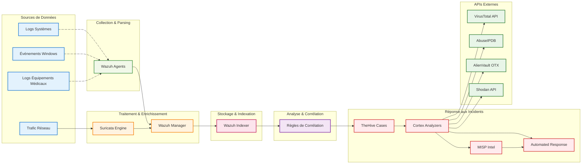
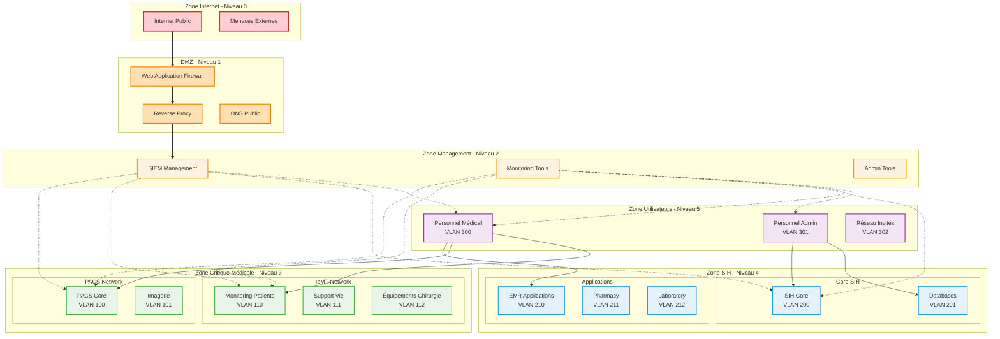

# Topologie Réseau SOC Hospitalier - Architecture Sécurité Pure

## Vue d'ensemble de l'Architecture

Cette documentation présente la topologie réseau complète d'un environnement hospitalier intégrant notre **stack SIEM/SOAR pure** optimisée pour une équipe de sécurité (Wazuh + TheHive + Cortex + MISP + Suricata).

## 🎯 **Architecture SOC Centrée Sécurité**

L'architecture élimine les composants business/métier pour se concentrer exclusivement sur la **détection, l'investigation et la réponse automatisée** aux incidents de cybersécurité.

## Diagramme Principal - Topologie SOC Hospitalière

```mermaid
flowchart TB
    subgraph "Internet & Externe"
        INT[Internet]
        CLOUD[Cloud Services]
        PARTNER[Partenaires Santé]
    end

    subgraph "DMZ - Zone Démilitarisée"
        FW1[Firewall Principal]
        LB[Load Balancer]
        PROXY[Proxy Web]
        DNS[DNS Serveur]
    end

    subgraph "Infrastructure SIEM/SOAR - Équipe Sécurité"
        subgraph "Wazuh SIEM Cluster"
            WM1[Wazuh Manager 1<br/>SIEM Principal]
            WM2[Wazuh Manager 2<br/>SIEM Secondaire]
            WI[Wazuh Indexer<br/>Stockage Sécurité]
            WD[Wazuh Dashboard<br/>Interface SOC]
        end
        
        subgraph "SOAR - Orchestration Sécurité"
            THEHIVE[TheHive Platform<br/>Gestion Incidents]
            CORTEX[Cortex Analytics<br/>Analyse Automatisée]
            MISP[MISP Threat Intel<br/>Renseignement Menaces]
        end
        
        subgraph "Network Security Monitoring"
            SURICATA[Suricata IDS/IPS<br/>Détection Réseau]
            PFENSE[pfSense Firewall<br/>Filtrage Avancé]
            OSQUERY[OSQuery<br/>Endpoint Detection]
        end
        
        subgraph "SOC - Centre Opérations Sécurité"
            SOC_DASH[Dashboard SOC Principal]
            ALERT_MGR[Gestionnaire Alertes]
            FORENSIC[Outils Forensiques]
        end
    end

    subgraph "Réseau Médical - Zone Critique"
        subgraph "Équipements Médicaux IoT"
            MRI[IRM Scanner<br/>10.100.1.10]
            XRAY[Scanner Rayons-X<br/>10.100.1.11]
            ECHO[Échographe<br/>10.100.1.12]
            MONITOR[Moniteurs Patients<br/>10.100.1.13-50]
            VENTILATOR[Respirateurs<br/>10.100.1.51-60]
        end
        
        subgraph "PACS & Imagerie"
            PACS_SRV[Serveur PACS<br/>10.100.2.10]
            PACS_DB[Base DICOM<br/>10.100.2.11]
            WORKSTATION[Stations Imagerie<br/>10.100.2.20-30]
        end
    end

    subgraph "Système d'Information Hospitalier"
        subgraph "Serveurs Critiques"
            SIH[Serveur SIH Principal<br/>10.200.1.10]
            DB_SIH[Base de Données SIH<br/>10.200.1.11]
            AD[Active Directory<br/>10.200.1.20]
            BACKUP[Serveur Backup<br/>10.200.1.30]
        end
        
        subgraph "Applications Métier"
            EMR[Dossier Patient<br/>10.200.2.10]
            PHARMACY[Pharmacie<br/>10.200.2.11]
            LAB[Laboratoire<br/>10.200.2.12]
            BILLING[Facturation<br/>10.200.2.13]
        end
    end

    subgraph "Postes Utilisateurs"
        subgraph "Personnel Médical"
            DOC_PC[PC Médecins<br/>10.300.1.10-50]
            NURSE_PC[PC Infirmières<br/>10.300.1.51-100]
            TECH_PC[PC Techniciens<br/>10.300.1.101-120]
        end
        
        subgraph "Administration"
            ADMIN_PC[PC Administratifs<br/>10.300.2.10-30]
            IT_PC[PC Support IT<br/>10.300.2.40-45]
        end
    end

    %% Connexions Internet
    INT --> FW1
    CLOUD --> FW1
    PARTNER --> FW1

    %% DMZ vers Infrastructure
    FW1 --> LB
    FW1 --> PROXY
    FW1 --> DNS
    LB --> PFENSE

    %% Infrastructure SIEM/SOAR - Flux Sécurité
    PFENSE --> WM1
    PFENSE --> WM2
    WM1 --> WI
    WM2 --> WI
    WI --> WD
    WD --> SOC_DASH
    
    %% SOAR - Orchestration
    WM1 --> THEHIVE
    WM2 --> THEHIVE
    THEHIVE --> CORTEX
    CORTEX --> MISP
    CORTEX --> ALERT_MGR
    
    %% Network Security Monitoring
    SURICATA --> WM1
    OSQUERY --> WM1
    PFENSE --> SURICATA
    SURICATA --> PFENSE
    
    %% SOC Operations
    ALERT_MGR --> SOC_DASH
    SOC_DASH --> FORENSIC

    %% Flux Réseau Inter-Zones
    %% Équipements Médicaux vers PACS
    MRI --> PACS_SRV
    XRAY --> PACS_SRV
    ECHO --> PACS_SRV
    MONITOR --> PACS_SRV
    VENTILATOR --> PACS_SRV
    
    %% PACS vers SIH
    PACS_SRV --> SIH
    WORKSTATION --> EMR
    
    %% SIH vers Applications Métier
    SIH --> EMR
    SIH --> PHARMACY
    SIH --> LAB
    SIH --> BILLING
    AD --> EMR
    AD --> PHARMACY
    
    %% Postes Utilisateurs vers Applications
    DOC_PC --> EMR
    DOC_PC --> PACS_SRV
    NURSE_PC --> EMR
    NURSE_PC --> PHARMACY
    TECH_PC --> LAB
    TECH_PC --> PACS_SRV
    ADMIN_PC --> BILLING
    ADMIN_PC --> AD
    IT_PC --> SIH
    IT_PC --> BACKUP

    %% Monitoring SIEM (lignes pointillées)
    MRI -.-> WM1
    XRAY -.-> WM1
    ECHO -.-> WM1
    MONITOR -.-> WM1
    VENTILATOR -.-> WM1
    PACS_SRV -.-> WM1
    PACS_DB -.-> WM1
    WORKSTATION -.-> WM1

    %% Monitoring SIH
    SIH -.-> WM2
    DB_SIH -.-> WM2
    AD -.-> WM2
    BACKUP -.-> WM2
    EMR -.-> WM2
    PHARMACY -.-> WM2
    LAB -.-> WM2
    BILLING -.-> WM2

    %% Monitoring Postes
    DOC_PC -.-> WM1
    NURSE_PC -.-> WM1
    TECH_PC -.-> WM1
    ADMIN_PC -.-> WM2
    IT_PC -.-> WM2

    %% Styles - Architecture SOC
    classDef medical fill:#e1f5fe,stroke:#0277bd,stroke-width:2px,color:#000000
    classDef siem fill:#f3e5f5,stroke:#7b1fa2,stroke-width:2px,color:#000000
    classDef critical fill:#ffebee,stroke:#c62828,stroke-width:2px,color:#000000
    classDef network fill:#e8f5e8,stroke:#2e7d32,stroke-width:2px,color:#000000
    classDef soc fill:#fff9c4,stroke:#f57f17,stroke-width:2px,color:#000000

    class MRI,XRAY,ECHO,MONITOR,VENTILATOR medical
    class PACS_SRV,PACS_DB,WORKSTATION medical
    class WM1,WM2,WI,WD siem
    class THEHIVE,CORTEX,MISP siem
    class SIH,DB_SIH,AD,BACKUP critical
    class EMR,PHARMACY,LAB,BILLING critical
    class FW1,LB,PROXY,DNS,PFENSE,SURICATA,OSQUERY network
    class SOC_DASH,ALERT_MGR,FORENSIC soc
    class DOC_PC,NURSE_PC,TECH_PC,ADMIN_PC,IT_PC medical
    ADMIN_PC -.-> WM2
    IT_PC -.-> WM2

    %% Trafic réseau via Suricata
    PFENSE --> SURICATA
    SURICATA --> PFENSE

    %% Styles
    classDef medical fill:#e1f5fe,stroke:#0277bd,stroke-width:2px
    classDef siem fill:#f3e5f5,stroke:#7b1fa2,stroke-width:2px
    classDef critical fill:#ffebee,stroke:#c62828,stroke-width:2px
    classDef network fill:#e8f5e8,stroke:#2e7d32,stroke-width:2px
    classDef user fill:#fff3e0,stroke:#ef6c00,stroke-width:2px

    class MRI,XRAY,ECHO,MONITOR,VENTILATOR medical
    class PACS_SRV,PACS_DB,WORKSTATION medical
    class WM1,WM2,WI,ES1,ES2,ES3,KIBANA,LOGSTASH siem
    class THEHIVE,CORTEX,MISP siem
    class SIH,DB_SIH,AD,BACKUP critical
    class EMR,PHARMACY,LAB,BILLING critical
    class FW1,LB,PROXY,DNS,PFENSE,SURICATA network
    class DOC_PC,NURSE_PC,TECH_PC,ADMIN_PC,IT_PC user
```



## Diagramme de Flux des Données de Sécurité



## Architecture de Détection par Type d'Attaque

```mermaid
flowchart TD
    subgraph "Types d'Attaques"
        BRUTE[Brute Force]
        XSS[Cross-Site Scripting]
        SCAN[Network Discovery]
        ETERNAL[EternalBlue]
        DOUBLE[DoublePulsar]
        RANSOMWARE[Ransomware]
        APT[APT & Lateral Movement]
    end

    subgraph "Couches de Détection"
        subgraph "Network Layer"
            SURICATA_NET[Suricata IDS]
            PFENSE_FW[pfSense Firewall]
        end
        
        subgraph "Host Layer"
            WAZUH_HIDS[Wazuh HIDS]
            OSQUERY[Osquery]
            SYSMON[Sysmon]
        end
        
        subgraph "Application Layer"
            WEB_LOGS[Web Server Logs]
            APP_LOGS[Application Logs]
            DB_LOGS[Database Logs]
        end
        
        subgraph "Intelligence Layer"
            MISP_TI[MISP Threat Intel]
            YARA_RULES[YARA Rules]
            IOC[IOC Matching]
        end
    end

    subgraph "Techniques de Détection"
        SIGNATURE[Signature-based]
        BEHAVIORAL[Behavioral Analysis]
        ANOMALY[Anomaly Detection]
        ML_AI[Machine Learning]
    end

    %% Mappings d'attaques vers détections
    BRUTE --> WAZUH_HIDS
    BRUTE --> WEB_LOGS
    BRUTE --> PFENSE_FW
    BRUTE --> BEHAVIORAL

    XSS --> WEB_LOGS
    XSS --> APP_LOGS
    XSS --> SURICATA_NET
    XSS --> SIGNATURE

    SCAN --> SURICATA_NET
    SCAN --> PFENSE_FW
    SCAN --> WAZUH_HIDS
    SCAN --> ANOMALY

    ETERNAL --> SURICATA_NET
    ETERNAL --> WAZUH_HIDS
    ETERNAL --> SYSMON
    ETERNAL --> SIGNATURE
    ETERNAL --> MISP_TI

    DOUBLE --> WAZUH_HIDS
    DOUBLE --> OSQUERY
    DOUBLE --> YARA_RULES
    DOUBLE --> IOC
    DOUBLE --> BEHAVIORAL

    RANSOMWARE --> WAZUH_HIDS
    RANSOMWARE --> SYSMON
    RANSOMWARE --> YARA_RULES
    RANSOMWARE --> BEHAVIORAL
    RANSOMWARE --> ML_AI

    APT --> SURICATA_NET
    APT --> WAZUH_HIDS
    APT --> OSQUERY
    APT --> MISP_TI
    APT --> BEHAVIORAL
    APT --> ML_AI

    %% Styles
    classDef attack fill:#ffcdd2,stroke:#d32f2f,stroke-width:2px
    classDef network fill:#c8e6c9,stroke:#388e3c,stroke-width:2px
    classDef host fill:#bbdefb,stroke:#1976d2,stroke-width:2px
    classDef app fill:#ffe0b2,stroke:#f57c00,stroke-width:2px
    classDef intel fill:#e1bee7,stroke:#7b1fa2,stroke-width:2px
    classDef technique fill:#f0f4c3,stroke:#689f38,stroke-width:2px

    class BRUTE,XSS,SCAN,ETERNAL,DOUBLE,RANSOMWARE,APT attack
    class SURICATA_NET,PFENSE_FW network
    class WAZUH_HIDS,OSQUERY,SYSMON host
    class WEB_LOGS,APP_LOGS,DB_LOGS app
    class MISP_TI,YARA_RULES,IOC intel
    class SIGNATURE,BEHAVIORAL,ANOMALY,ML_AI technique
```



## Segmentation Réseau et Zones de Sécurité



## Matrice des Permissions et Flux Réseau

| Source Zone | Destination Zone | Protocoles Autorisés | Contrôles | Monitoring |
|--------------|------------------|---------------------|-----------|------------|
| Internet | DMZ | HTTPS:443, DNS:53 | WAF, DPI | ✅ Full |
| DMZ | Management | SSH:22, HTTPS:443 | VPN, 2FA | ✅ Full |
| Management | Medical Critical | SNMP:161, SSH:22 | Privilege escalation | ✅ Full |
| Management | SIH | RDP:3389, SSH:22 | Jump box | ✅ Full |
| Medical Users | PACS | DICOM:104, HTTP:80 | User auth | ✅ Full |
| Medical Users | IoMT | HL7:2575, Custom | Device auth | ✅ Full |
| Admin Users | SIH Core | RDP:3389, SQL:1433 | Admin rights | ✅ Full |
| Medical Critical | Internet | ❌ Denied | Air gap | ✅ Alerts |
| SIH Core | Internet | ❌ Denied | Air gap | ✅ Alerts |

## Points de Surveillance Critiques

### 1. Équipements Médicaux IoT
- **Monitoring** : Wazuh agents + SNMP
- **Alertes** : Anomalies comportementales, communications non autorisées
- **Criticité** : HAUTE (impact patient direct)

### 2. Serveurs PACS
- **Monitoring** : Logs d'accès DICOM, intégrité images
- **Alertes** : Modifications non autorisées, accès suspects
- **Criticité** : HAUTE (données diagnostiques)

### 3. Base de Données SIH
- **Monitoring** : Requêtes SQL, accès privilégiés
- **Alertes** : Extraction massive, modifications sensibles
- **Criticité** : CRITIQUE (HIPAA compliance)

### 4. Postes Utilisateurs
- **Monitoring** : Comportement utilisateur, installations
- **Alertes** : Malware, phishing, données exfiltrées
- **Criticité** : MOYENNE (point d'entrée)

## Configuration des VLANs de Sécurité

### VLAN Medical Critical (100-119)
```
VLAN 100: PACS Core Servers
VLAN 101: Imaging Workstations  
VLAN 110: Patient Monitoring
VLAN 111: Life Support Systems
VLAN 112: Surgical Equipment
```

### VLAN SIH (200-219)
```
VLAN 200: SIH Core Infrastructure
VLAN 201: Database Servers
VLAN 210: EMR Applications
VLAN 211: Pharmacy Systems
VLAN 212: Laboratory Systems
```

### VLAN Users (300-319)
```
VLAN 300: Medical Staff
VLAN 301: Administrative Staff
VLAN 302: Guest Network
VLAN 310: SIEM Management
```

Cette topologie assure une surveillance complète de l'environnement hospitalier avec une séparation appropriée des zones critiques et un monitoring centralisé via notre stack SIEM/SOAR.
