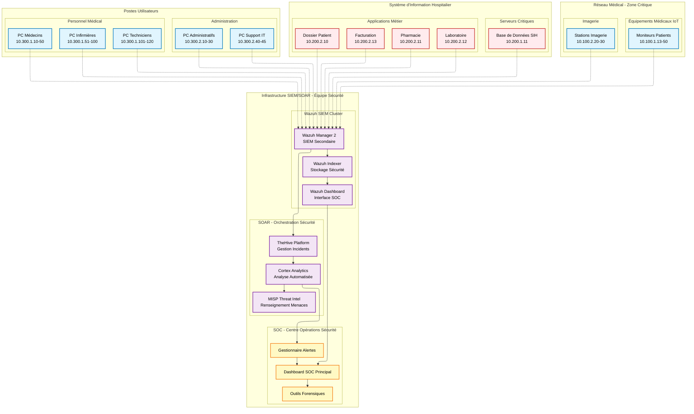

# Topologie Réseau SOC Hospitalier - Architecture Sécurité Pure

## Vue d'ensemble de l'Architecture

Cette documentation présente la topologie réseau complète d'un environnement hospitalier intégrant notre **stack SIEM/SOAR pure** optimisée pour une équipe de sécurité (Wazuh + TheHive + Cortex + MISP + Suricata).

## 🎯 **Architecture SOC Centrée Sécurité**

L'architecture élimine les composants business/métier pour se concentrer exclusivement sur la **détection, l'investigation et la réponse automatisée** aux incidents de cybersécurité.

## Diagramme Principal - Topologie SOC Hospitalière

